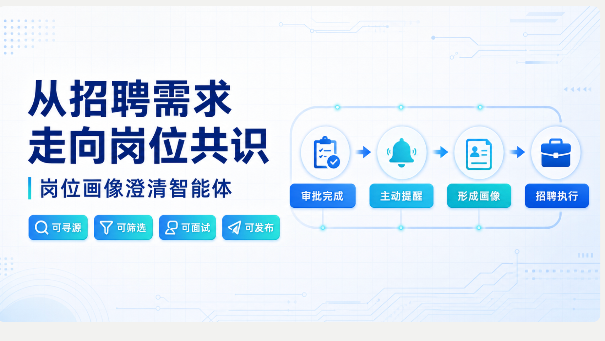

# 岗位画像澄清 Agent MVP

一个可运行的招聘岗位澄清工作台：React 前端、Fastify API、PostgreSQL 业务事实层、异步 Agent Run/SSE，以及锁定官方源码的 DeepSeek Harness Sidecar。

点击上图查看 [Railway 线上项目介绍](https://agent-intro-web-production.up.railway.app)，或直接进入 [Railway 线上招聘工作台](https://web-production-a9f14.up.railway.app)。

## 当前可以跑通

- 登录页只开放三个预置演示账号：用人经理、HR 和企业管理员；账号、姓名与角色由后端白名单固定校验，权限来自签名 HttpOnly Cookie。
- 登录后仍以会话工作区呈现，Agent 在首条消息中列出 10 条紧凑的已通过产研/算法 HC；在用户明确选择 HC 前不加载历史会话。
- 每条 HC 幂等绑定一个岗位工作区：首次选择建立空会话，再次选择继续原会话，历史画像、消息与 Trace 均保留。
- 三个预置账号按岗位成员关系读取数据，企业管理员可以查看演示企业空间的全部岗位与 Trace；不支持注册第四个账号。
- 三种角色都能以真实身份和 Agent 对话，消息、回复与主动澄清轮次持久化保存；普通对话不限轮数。
- 企业管理员拥有租户级最高权限，并可在完整 Trace 控制台查看全岗位运行、用户原文、模型输入输出、工具调用和审计记录。
- 用人经理无需先填岗位表单：第一条自然语言消息会建立待识别岗位，Agent 再从对话中提取职位、团队和招聘原因，并通过 SSE 持续回复。
- 同一岗位可从 Web 或飞书机器人单聊继续澄清；飞书可用卡片返回 Agent 问题、岗位画像、评估方案、四段式 JD 和 HR 招聘画像。
- 生成、版本化和确认岗位画像、评分卡、四段式公开 JD、HR 内部招聘画像。
- 导入 JSON/纯文本脱敏候选人；手机号、邮箱和显式姓名在进入模型前被拒绝。
- 候选人达到“10 名＋2 个渠道＋2 次同类卡点”后进入 HR 审核；HR 通过后才创建经理任务。
- 正式产物使用只追加版本、content_hash、乐观锁和下游确认失效。
- 完整 Trace 将注入上下文拆成 System Prompt、当前用户输入、短期会话记忆、长期岗位记忆和任务状态，并保存实际模型 Prompt、最终输出、工具入参与返回、Token 和延迟；API Key、Cookie、内部令牌与模型未提供的隐藏思维链不采集。

## 本地启动

要求 Node.js 24、Corepack 和 PostgreSQL。

    corepack pnpm install
    cp .env.example .env
    corepack pnpm harness:prepare
    corepack pnpm dev

访问 http://localhost:5173。登录页直接选择三个固定演示身份之一：`manager-demo`（用人经理 · 陈曦）、`hr-demo`（HR · 林夏）或 `admin-demo`（企业管理员 · 周宁）。服务端只接受 `legacy-demo` 企业空间中的这三个账号，并校验固定姓名和角色。

登录后，Agent 会在首屏会话中列出十条已审批 HC，覆盖新增编制、离职补充、汰换补充、组织调整和其他补充。用人经理选择其中一条后，Agent 会结合审批原因与组织缺口主动提出第一个澄清问题；进入岗位后侧栏只显示当前会话，并可返回 HC 选择页，既有岗位会继续原有进度，重复选择同一 HC 不会创建重复会话或首问。

在 `.env` 中填写 `DEEPSEEK_API_KEY` 后，`pnpm dev` 会同时启动 Web、API 和真实 Harness Sidecar。若暂时不配置 `DATABASE_URL`，API 会使用带兼容测试夹具的内存 Store；动态注册的新账号仍按成员关系隔离。所有 Agent 请求都会通过 Sidecar 调用真实 Harness。

## Docker Compose 测试环境

    docker compose up --build

先在环境中设置 `DEEPSEEK_API_KEY`，再访问 http://localhost:8080。Compose 使用 PostgreSQL 和真实 Harness Sidecar；没有密钥时服务仍可启动和读取正式产物，但 Agent Run 会明确返回 `HARNESS_NOT_READY`。

## Railway 线上环境

生产环境拆为 `web`、`api`、`harness-sidecar` 和 PostgreSQL 四个 Railway 服务。只有 `web` 生成公开域名；浏览器的 REST、登录 Cookie 和 SSE 都由 Caddy 同源转发到 API。API、Harness 和数据库使用 Railway 私网互联，不直接暴露公网。Caddy 会按 Railway DNS TTL 重新解析 API 私网地址，服务滚动重启后不会继续使用旧 IP。

三个应用服务都从仓库根目录构建，并分别设置：

- `web`: `RAILWAY_DOCKERFILE_PATH=/apps/web/Dockerfile`，`PORT=80`，`API_UPSTREAM=http://api.railway.internal:4100`
- `api`: `RAILWAY_DOCKERFILE_PATH=/apps/api/Dockerfile`，`PORT=4100`，`DATABASE_URL=${{Postgres.DATABASE_URL}}`，`HARNESS_BASE_URL=http://harness-sidecar.railway.internal:4110`
- `harness-sidecar`: `RAILWAY_DOCKERFILE_PATH=/apps/harness-sidecar/Dockerfile`，`SIDECAR_PORT=4110`，`ROLE_AGENT_INTERNAL_URL=http://api.railway.internal:4100`

`SESSION_SECRET`、`HARNESS_SIDECAR_TOKEN`、`ROLE_AGENT_TOOL_TOKEN` 和 `DEEPSEEK_API_KEY` 只写入 Railway Secret，不提交 Git。飞书连接的变量与配置步骤见 `docs/feishu-integration.md`；完整 Railway 变量和验收步骤见 `docs/railway-deployment.md`。

## DeepSeek Harness

领域 Bundle 位于 `packages/dsh-role-clarifier`，真实 Sidecar 位于 `apps/harness-sidecar`。Bundle：

- 注册 read_role_state、update_role_identity_draft、save_fact_draft、save_artifact_draft、save_candidate_evidence、propose_calibration_signal、read_version_diff 七个工具。
- 禁用 Shell、PowerShell、文件读写/搜索、Web、任务、工作流、Skill 和子 Agent 工具。
- 工具 Schema 不接受角色、用户或租户参数；服务端通过当前 Agent Run 和 Harness Session 注入身份。
- Flash 执行事实/问题/候选人证据提取，Pro 执行正式产物与校准建议。

官方 npm 没有发布 `0.1.0-rc.5`，因此项目没有静默升级到 rc.6，而是把官方仓库精确锁定到提交 `47f943859bef60e4160492346772ded9b24f765a`。准备脚本校验该提交的根版本确实为 `0.1.0-rc.5`，构建官方 JSON-RPC runtime，再把领域 Bundle 作为外部 Cordis 插件编译进去。

    corepack pnpm harness:prepare

静态工具面门禁和不访问外部服务的 JSON-RPC 本地模型桩验收：

    corepack pnpm harness:verify
    corepack pnpm harness:smoke:runtime

Flash/Pro 分别映射到官方 `deepseek-v4-flash` 和 `deepseek-v4-pro`。Sidecar 使用 Bearer Token 与 API 隔离；模型工具请求再使用独立内部 Token。真实模型 Smoke Test 需要使用者在本地 `.env` 写入有效 Key，密钥不提交 Git。详细记录见 `docs/harness-spike.md`。

## 主要命令

    corepack pnpm typecheck
    corepack pnpm test
    corepack pnpm build
    corepack pnpm harness:verify
    corepack pnpm harness:prepare
    corepack pnpm harness:smoke:runtime

## 工程结构

    apps/web/                      React 招聘工作台、登录、API/SSE
    apps/api/                      Fastify API、Agent Runner、PostgreSQL Store
    apps/harness-sidecar/          官方 JSON-RPC runtime 桥接、模型路由与 Trace
    apps/intro-web/                项目介绍站点
    packages/contracts/            共享 Zod Schema 与 API 类型
    packages/domain/               状态机、哈希、PII、校准和失效规则
    packages/dsh-role-clarifier/   Cordis Bundle 与七个领域工具
    packages/dsh-profile/          dsh-base + dsh-headless + 领域 Bundle Profile
    docs/product/                  PRD、前端方案与评测任务说明
    docs/                          集成、部署与技术文档
    evals/                         评测用例与样本
    scripts/                       Harness、数据库与仓库维护脚本
    openspec/                      需求规格与变更记录
    docker-compose.yml             PostgreSQL + API + Web 测试环境

## 安全边界

- 外部请求里的 actor_role、actor_user_id 和 tenant_id 永远不参与授权。
- 经理读取 HR 内部画像、候选人证据和信号时返回无该字段的对象，不能通过 URL 越权。
- Agent 主动澄清默认 6 轮、每次由人类增加 2 轮；最多 10 次状态转换只是单次 Run 的内部安全阈值，不限制日常对话。
- Trace API 仅企业管理员可访问；当前测试环境允许展示通过 PII 门禁的完整业务/候选人输入，但不采集密钥、会话凭证、内部令牌与模型未提供的隐藏思维链。
- 模型只能写草稿或提出信号，不能确认、发布、审核或替人类作校准决定。
- 首期没有真实 ATS、SSO、外部发布、PDF/DOCX 解析；发布最多进入 READY_TO_PUBLISH。
