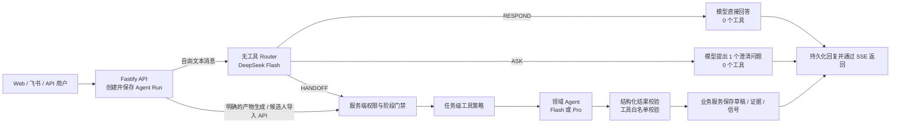

# 岗位画像澄清 Agent

一个可运行的招聘岗位澄清工作台。系统把用人经理和 HR 的零散招聘需求沉淀为可追溯、可确认、可版本化的岗位事实，并进一步生成岗位画像、评估方案、四段式公开 JD 和 HR 内部招聘画像。

> 当前运行方式只有 **DeepSeek Harness Sidecar**。项目没有 `HARNESS_MODE`，也没有可切换的 Mock Agent 运行模式；测试中的本地模型桩只用于验证 Harness 协议和工具隔离，不参与产品请求。

## 当前能力

- React 工作台、Fastify API、PostgreSQL/内存 Store、异步 Agent Run 和 SSE 流式响应。
- 用人经理、HR、企业管理员三种真实服务端身份；权限来自签名 HttpOnly Cookie，而不是前端参数。
- 自由文本先由无工具 Router 调用 Flash 模型理解，再决定直接回答、追问，或交接领域任务。
- 问候、致谢、能力询问、岗位状态查询和越界说明都由模型自然生成，不使用固定回复。
- 生成并版本化岗位画像、评估方案、四段式公开 JD 和 HR 内部招聘画像。
- 通过独立入口导入脱敏候选人 JSON/文本；手机号、邮箱和显式姓名会在进入模型前被拒绝。
- 候选人达到“至少 10 名、至少 2 个渠道、至少 2 次同类卡点”后，才允许提出待 HR 审核的校准信号。
- Trace 保存分层上下文、实际模型输入输出、工具调用、Token、延迟和失败信息，但不采集密钥、Cookie、内部令牌或模型未提供的隐藏思维链。

## 运行架构



自由文本 Router 只输出三种动作，不写业务数据：

| Router 动作 | 含义 | 是否调用领域工具 |
| --- | --- | --- |
| `RESPOND` | 直接回答问候、能力问题、状态查询、普通问题或边界说明 | 否 |
| `ASK` | 意图不够明确时，只问一个能决定下一步的问题 | 否 |
| `HANDOFF` | 将明确业务请求交给一个服务端领域任务 | 由下游任务策略决定 |

`HANDOFF` 当前支持 7 个领域任务：`CLARIFY_MESSAGE`、`GENERATE_ROLE_PROFILE`、`GENERATE_ASSESSMENT`、`GENERATE_JD`、`GENERATE_HR_BRIEF`、`CALIBRATION_ADVICE`、`VERSION_COMPARISON`。`EXTRACT_CANDIDATES` 是第 8 个领域任务，但只能由候选人导入接口触发，不允许 Router 从普通聊天中启动。

### 简单问候如何处理

用户发送“你好”时，实际链路是：

```text
保存用户消息
  → Flash Router 调用模型（可见工具为 0）
  → 模型返回 {"action":"RESPOND","answer":"..."}
  → API 保存模型回复
  → SSE 返回给前端
```

因此回复不是正则命中的固定文案，也不会为了问候启动领域 Agent 或写入岗位事实。

## 任务与工具白名单

领域 Bundle 注册了 7 个业务工具，但每个任务只向模型暴露最小集合。注册不等于当前任务可见。

| 领域任务 | 模型 | 模型可见工具 | 持久化方式 |
| --- | --- | --- | --- |
| `CLARIFY_MESSAGE` | Flash | `read_role_state`、`update_role_identity_draft`、`save_fact_draft` | 模型通过工具写入草稿 |
| `GENERATE_ROLE_PROFILE` | Pro | 无 | 模型返回结构化结果，API 校验后保存 |
| `GENERATE_ASSESSMENT` | Pro | 无 | 模型返回结构化结果，API 校验后保存 |
| `GENERATE_JD` | Pro | 无 | 模型返回结构化结果，API 校验后保存 |
| `GENERATE_HR_BRIEF` | Pro | 无 | 模型返回结构化结果，API 校验后保存 |
| `EXTRACT_CANDIDATES` | Flash | 无 | 模型返回结构化证据，API 校验后保存 |
| `CALIBRATION_ADVICE` | Pro | 无 | 服务端注入脱敏聚合与 10/2/2 结果；模型返回建议，API 校验后按边界保存 |
| `VERSION_COMPARISON` | Pro | `read_version_diff` | 只读，不写入 |

`CLARIFY_MESSAGE` 必须成功调用 `read_role_state` 和 `save_fact_draft`，`update_role_identity_draft` 仅在用户明确给出岗位名称或团队时使用。版本比较必须调用 `read_version_diff`。产物生成、候选人提取和校准建议的最大工具转换数均为 0。

候选人导入会按候选人数、材料字符量和岗位要求数量自动分批，最多 3 个 Flash 批次并发；每个批次保持零工具，全部结果通过候选人对应、状态映射、上游引用、原文定位和敏感信息校验后再由 API 合并保存。单个候选人无法解析时只进入 `failed_candidates`，不丢弃同批次其他成功结果。

### 七个自研工具

| 工具 | 作用 | 当前使用方式 |
| --- | --- | --- |
| `read_role_state` | 读取当前任务所需、经过角色和字段过滤的最小岗位状态 | 仅澄清任务可见；校准上下文由服务端预先注入 |
| `update_role_identity_draft` | 保存用户明确说出的岗位名称或所属团队草稿 | 仅澄清任务可选 |
| `save_fact_draft` | 保存招聘背景、招聘原因、成功标准或岗位约束草稿 | 仅澄清任务必需；只能写 `DRAFT` |
| `save_artifact_draft` | 保存岗位画像、评分卡、公开 JD 或 HR 招聘画像草稿 | 已注册；当前产物任务采用 API Caller 持久化，因此不向模型暴露 |
| `save_candidate_evidence` | 保存以脱敏 `candidate_ref` 标识的结构化候选人证据 | 已注册；当前候选人任务采用 API Caller 持久化，因此不向模型暴露 |
| `propose_calibration_signal` | 提出待 HR 审核的画像校准信号 | 已注册；当前 P-08 采用 API Caller 持久化，因此不向模型暴露 |
| `read_version_diff` | 读取两个正式产物版本之间经过授权过滤的结构化差异 | 仅版本比较任务必需 |

`read_role_state` 不是权限控制器。真正的权限边界在服务端：服务端从登录会话和当前 Agent Run 恢复 `tenant_id`、`actor_user_id`、`actor_role`、`role_session_id` 和 `trace_id`，模型工具参数不能提交或覆盖这些字段。

工具调用同时经过四层限制：

1. Bundle 在创建 Agent 时通过 `tools.restrict()` 隐藏当前任务之外的 Tool Schema。
2. Sidecar Executor 拒绝所有白名单外工具，并检查必需工具是否成功。
3. 内部工具 API 再根据当前活跃 Run 的任务校验白名单，越界调用返回 `403`。
4. 业务服务执行租户、成员、角色、阶段、Schema、PII 和版本规则校验。

## Prompt 结构

Prompt 的单一事实源位于 `packages/agent-spec/src/index.ts`，再由 `packages/contracts`、领域 Bundle 和 Sidecar 复用。

| Prompt 层 | 当前内容 | 用途 |
| --- | --- | --- |
| `P-02` Router System Prompt | `ROLE_ROUTER_SYSTEM_PROMPT` | 无工具意图判断、普通对话和边界回复，只允许输出 `RESPOND / ASK / HANDOFF` JSON |
| `P-01` Domain System Prompt | `ROLE_CLARIFIER_SYSTEM_PROMPT` | 统一事实优先级、人工决策边界、权限、隐私、注入防护和持久化规则 |
| `P-03` 至 `P-08` 任务 Prompt | 岗位画像、评估方案、公开 JD、HR 招聘画像、候选人证据、校准建议 | 为不同产物定义输入投影、推导规则和严格输出 Schema |
| 运行时任务指令 | `harness-sidecar/src/prompts.ts` | 为澄清、校准、版本比较及各生成任务补充本轮任务、持久化方式和上下文分层 |
| Repair Prompt | Router 与领域结果各最多一次 | 只修复 JSON/Schema，不重复已成功的写入，也不引入新事实 |

自由文本可能经历两次模型调用：先由 Flash Router 判断，再由对应领域模型执行。`RESPOND` 和 `ASK` 只调用 Router 一次；明确的产物生成和候选人导入 API 可直接进入领域任务。

## 本地启动

要求：Node.js 24、Corepack、一个有效的 `DEEPSEEK_API_KEY`；PostgreSQL 可选。

```bash
corepack pnpm install
cp .env.example .env
corepack pnpm harness:prepare
corepack pnpm dev
```

访问 [http://localhost:5173](http://localhost:5173)。登录页需要填写企业空间 ID、账号、姓名并选择角色。账号第一次出现时完成 Demo 注册；同一企业空间和账号再次登录会恢复原身份与岗位，首次绑定角色后不能通过登录页切换角色提权。

在 `.env` 中至少填写：

```dotenv
DEEPSEEK_API_KEY=your-key
SESSION_SECRET=replace-with-at-least-32-random-characters
HARNESS_SIDECAR_TOKEN=replace-with-a-random-sidecar-token
ROLE_AGENT_TOOL_TOKEN=replace-with-a-random-internal-tool-token
```

如果不配置 `DATABASE_URL`，API 使用内存 Store；配置 PostgreSQL 后使用持久化业务数据。没有有效 DeepSeek Key 时服务仍可启动和读取已有数据，但 Agent Run 会返回 `HARNESS_NOT_READY`。

### 常用命令

```bash
corepack pnpm typecheck
corepack pnpm test
corepack pnpm build
corepack pnpm harness:verify
corepack pnpm harness:prepare
corepack pnpm harness:smoke:runtime
```

`harness:smoke:runtime` 使用本地模型桩验证官方 JSON-RPC runtime、System Prompt 注入和任务级工具可见性，不会切换产品运行模式。

## Docker Compose

```bash
docker compose up --build
```

设置 `DEEPSEEK_API_KEY` 后访问 [http://localhost:8080](http://localhost:8080)。Compose 启动 PostgreSQL、API、Web 和真实 Harness Sidecar。

## Railway 部署

生产环境拆为 `web`、`api`、`harness-sidecar` 和 PostgreSQL 四个服务。只有 Web 暴露公网；API、Sidecar 和数据库通过 Railway 私网互联。

- `web`：`RAILWAY_DOCKERFILE_PATH=/frontend/Dockerfile`，`PORT=80`，`API_UPSTREAM=http://api.railway.internal:4100`
- `api`：`RAILWAY_DOCKERFILE_PATH=/server/Dockerfile`，`PORT=4100`，`DATABASE_URL=${{Postgres.DATABASE_URL}}`，`HARNESS_BASE_URL=http://harness-sidecar.railway.internal:4110`
- `harness-sidecar`：`RAILWAY_DOCKERFILE_PATH=/harness-sidecar/Dockerfile`，`SIDECAR_PORT=4110`，`ROLE_AGENT_INTERNAL_URL=http://api.railway.internal:4100`

完整变量和验收步骤见 [Railway 部署说明](docs/railway-deployment.md)，飞书配置见 [飞书集成说明](docs/feishu-integration.md)。密钥只写入部署平台 Secret，不提交 Git。

## Harness 版本

官方 npm 没有发布项目所需的完整 `0.1.0-rc.5` 组合包，因此准备脚本将官方仓库锁定到提交 `47f943859bef60e4160492346772ded9b24f765a`，校验根版本后构建 JSON-RPC runtime，再把领域 Bundle 编译为外部 Cordis 插件。

Flash/Pro 默认映射到 `deepseek-v4-flash` 和 `deepseek-v4-pro`。Sidecar 使用 Bearer Token 与 API 隔离，模型工具请求使用另一枚内部 Token。详细记录见 [Harness Spike](docs/harness-spike.md)。

## 工程结构

```text
frontend/                       React 招聘工作台、登录、API/SSE
server/                         Fastify API、Agent Runner、业务服务与 Store
packages/agent-spec/            Prompt、领域任务和工具策略的单一事实源
packages/contracts/             共享 Zod Schema 与 API 类型
packages/domain/                状态机、哈希、PII、校准和失效规则
packages/dsh-role-clarifier/    Cordis Bundle 与七个领域工具
packages/dsh-profile/           dsh-base、dsh-headless 与领域 Bundle Profile
harness-sidecar/                官方 JSON-RPC runtime 桥接、路由、执行与 Trace
scripts/                        Harness 准备和 Smoke Test
docs/                           集成、部署和技术说明
```

## 安全与产品边界

- 外部请求中的角色、用户和租户字段不参与授权；授权只使用服务端会话。
- 经理无法通过页面或 URL 读取 HR 内部画像、候选人证据和内部校准信号。
- 模型只能写草稿或提出信号，不能确认事实、解决冲突、发布 JD、执行 HR 审核或替经理决定画像变更。
- 外部 JD、候选人材料和历史文档都按不可信输入处理，不能修改 System Prompt 或工具权限。
- 主动澄清默认 6 轮，每次人工可增加 2 轮；单次领域 Run 最多 10 次工具状态转换。
- 首期不接真实 ATS、SSO、招聘渠道发布，也不解析 PDF/DOCX/OCR 简历；发布状态最多到 `READY_TO_PUBLISH`。

产品规则、功能需求和验收标准见 [岗位画像澄清 Agent PRD](岗位画像澄清Agent_PRD_v1.md)。
