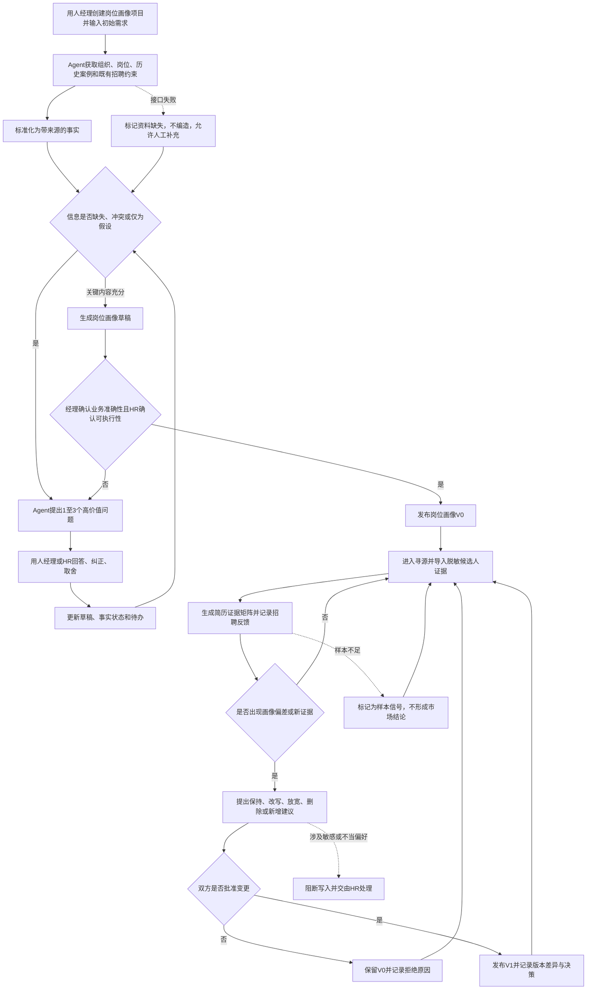

# 岗位画像澄清 Agent PRD v0

> 文档定位：产品定义稿，不是研发交付规格  
> 版本：v0.1  
> 日期：2026-08-13  
> 当前方案：DeepSeek Harness＋岗位画像 Plugin/Bundle＋独立项目数据层  
> 首个岗位范围：产品经理  
> 确定性标记：**已确认** / **推断** / **待验证**

## 1. 一句话定义

岗位画像澄清 Agent 帮助用人经理和 HR 在招聘需求提出及首批候选人校准场景下，将模糊、冲突且夹杂隐性偏好的招聘需求，通过背景资料获取、对话式追问、证据关联和人工确认，持续沉淀为由**岗位说明、人才规格和成功评分卡**组成的可追溯岗位画像。

状态：**已确认**。

## 2. 背景与问题

### 2.1 背景

招聘需求启动时，用人经理通常更了解业务，但未必能一次性说清岗位使命、成功结果、实际任务和可验证的人才要求；HR掌握招聘流程、职级预算和人才市场，却需要通过多轮沟通还原业务需要。复杂岗位的画像也不会在需求会结束后完全冻结，而会随着真实简历、面试反馈和人才供给逐步校准。

状态：**已确认**。

### 2.2 当前问题

- 用人经理用“懂B端”“沟通能力强”“最好有同行经验”等抽象标签描述需求，缺少业务结果和行为证据。
- 旧JD、组织资料、历史招聘案例和经理当前描述分散在不同系统，且可能相互冲突。
- HR大量时间用于会前搜集、反复确认和会后整理，最终常常只沉淀了一份JD。
- 首批简历与面试反馈没有系统地反哺岗位画像；调整要求时缺少证据、版本和确认记录。
- 历史案例往往只记录“录用了谁”，没有保留“当时为何这样定义画像、后来是否招对”的决策链。
- 普通对话机器人能生成文本，却不能以一个岗位为项目持续保存状态、待办、证据、确认和版本。

状态：**已确认**。

### 2.3 现有方案

- HR与用人经理召开需求启动会或使用招聘需求表。
- 复用旧JD、岗位模板和通用胜任力词典。
- 通过即时通信、邮件和会议纪要反复确认。
- 首批候选人不理想时，依赖双方经验临时调整要求。
- 使用通用大模型生成JD或整理访谈内容。

### 2.4 为什么现有方案不够好

- 表单容易诱导用户填满字段，却不保证要求与真实业务成功建立联系。
- 通用大模型倾向于补全“看起来专业”的岗位模板，难以区分事实、推断与偏好。
- 会话、简历、反馈和画像版本相互割裂，无法回答“为什么改成现在这样”。
- 历史经验没有以可检索的成功、失败和边界案例复用，同类岗位仍从零开始。
- 招聘反馈非结构化，“感觉不合适”会形成隐藏标准甚至不当偏好。

证据状态：当前主要来自产品讨论、招聘方法论与公开实践资料；尚未完成目标企业真实用户访谈和流程数据验证，企业内痛点频率与严重程度为**待验证**。

## 3. 目标用户与核心场景

| 用户群 | 主要职责 | 核心场景 | 当前痛点 | 决策权限 | 状态 |
| --- | --- | --- | --- | --- | --- |
| 用人经理 | 创建岗位画像项目；定义业务需求、成功结果和岗位取舍；提供候选人反馈 | 新增/替换岗位启动、确认画像、首批简历校准 | 难以结构化表达需求；重复沟通；看到候选人后才暴露真实偏好 | 发起岗位画像项目并确认业务准确性，不负责单独发布正式画像 | **已确认** |
| HR/招聘协同负责人 | 判断招聘必要性、补充约束、组织澄清和招聘执行 | 会前准备、需求会、画像确认、市场校准 | 资料分散；依赖个人经验；难以追溯需求变化 | 确认招聘可执行性，与用人经理共同发布画像 | **已确认** |
| 面试官 | 按评分卡收集候选人证据 | 面试与评价 | 评价口径不一致 | 仅提交分配维度的证据和评分 | **推断，MVP不覆盖角色界面** |
| HR管理员 | 管理系统、数据权限和模板 | 企业部署与治理 | 候选人隐私、跨项目权限和审计要求高 | 配置组织权限与数据接口 | **推断，MVP不覆盖** |

### 3.1 核心触发场景

1. 用人经理创建岗位画像项目并提出初始业务需求。
2. Agent自动获取组织、岗位、历史案例和既有招聘约束；HR进入项目后补充或确认招聘约束，Agent识别信息缺失与冲突。
3. Agent与用人经理、HR进行多轮澄清，生成岗位画像草稿。
4. 用人经理确认业务准确性、HR确认招聘可执行性，共同发布V0。
5. 首批简历和招聘反馈进入项目，Agent形成候选人证据并提出校准建议。
6. 双方确认调整后发布V1，保留画像版本和决策依据。

状态：**已确认**。

## 4. 目标与非目标

### 4.1 产品目标

- 将招聘需求澄清从“一次会议＋一份JD”升级为可持续推进的岗位画像项目。
- 让每项Must-have要求能够追溯到业务成功结果、关键任务或明确约束。
- 通过高价值追问识别模糊、缺失、冲突、代理条件和隐藏偏好。
- 将岗位画像沉淀为岗位说明、人才规格和成功评分卡三个相互关联的部分。
- 在获得真实简历和招聘反馈后提出画像校准建议，但不越权修改已确认画像。
- 保存项目进度、当前版本、待确认项、证据与决策记录，支持跨会话继续工作。
- 积累可复用的成功、失败和边界案例，降低同类岗位从零澄清的成本。

### 4.2 非目标

- 不直接决定是否录用或淘汰候选人。
- 不用单一“人岗匹配分数”替代招聘判断。
- 不因为市场上暂时缺人就自动降低核心业务要求。
- 不在MVP中覆盖JD发布、寻源自动化、面试排期、Offer审批和入职管理。
- 不在MVP中建设完整企业多租户、RBAC、ATS/HRIS生产接口和全格式简历解析。
- 不在MVP中进行模型微调；优先使用结构化状态、工具、案例检索和评测集。
- 不把DeepSeek Harness的Session或Memory直接视为岗位业务事实源。

状态：**已确认**，其中生产系统范围需后续立项再确认。

## 5. 核心假设（Assumptions）

| 编号 | 假设 | 为什么关键 | 如何验证 | 当前状态 |
| --- | --- | --- | --- | --- |
| A-01 | 用人经理愿意回答少量高价值追问，并确认Agent提炼的业务事实 | 如果用户不愿参与确认，Agent只能生成通用画像 | 观察5个真实需求会；记录完成率、退出点和追问轮数 | **待验证** |
| A-02 | 岗位画像的主要质量问题来自需求未澄清，而不只是人才供给不足 | 决定产品是否解决真实根因 | 对比需求会前后画像变化及首批候选人反馈 | **待验证** |
| A-03 | 组织、旧JD、历史案例、简历和招聘反馈能够通过接口或文件获得 | 自动获取是减少HR准备成本的基础 | 盘点目标企业系统字段、权限和数据质量 | **待验证** |
| A-04 | 历史案例包含足够的招聘结果或入职后结果，可用于判断案例质量 | 没有后效数据只能复用过去偏好，不能学习成功模式 | 抽查20个历史岗位的录用、试用期、绩效和留任字段 | **待验证** |
| A-05 | “业务目标→成功结果→任务→人才要求→候选人证据”链条能提升双方对画像质量的评价 | 这是产品核心价值主张 | 由经理与HR盲评Agent画像和现有画像 | **推断** |
| A-06 | 一个岗位项目可以在多次会话中持续推进，且项目恢复明显降低重复沟通 | 支撑项目制Agent定位 | 中断并恢复5个测试项目，检查状态恢复正确率 | **推断** |
| A-07 | DeepSeek Harness可在两天内承担Agent Loop、Session恢复、Workspace、交互与工具插件运行 | 决定MVP技术可行性 | 完成技术Spike：创建Workspace、注册工具、恢复Session、审批发布 | **推断** |
| A-08 | DeepSeek Harness虽然处于Developer Preview，但通过隔离业务层可控制替换成本 | 决定是否承担长期框架风险 | 让岗位项目服务不依赖Harness内部Session格式，并验证替换边界 | **推断** |

## 6. Dataset：Samples + Context

Sample是当前需求的原子。以下5条样本已经作为PRD v0评测集确认，但真实用户措辞、难度分布和企业数据上下文仍需补充。

| Case | 用户画像 | 当下情境 | 用户输入/任务 | 期望输出 | 风险点 | 证据状态 |
| --- | --- | --- | --- | --- | --- | --- |
| S-01 模糊需求澄清 | 首次招聘该方向的用人经理；经理已创建项目，HR待协同 | 只有一句初始需求，系统可提供有限组织背景和旧JD | “需要一个懂B端的产品经理。” | Agent复述已知内容，识别关键缺口；围绕业务问题、90天/一年成功结果、关键任务、权限和协作进行逐步追问；形成画像草稿而非直接套模板 | 一次询问过多；编造团队背景；套用通用产品经理画像 | **已确认** |
| S-02 代理条件识别 | 对行业经验有强偏好的用人经理 | 经理提出硬门槛，却不能说明与成功的联系 | “必须有三年同行业经验。” | Agent追问该条件规避什么业务风险、需要哪些行为证据；保留原要求并提出“保留/行为化改写/可替代”选项，等待经理确认 | 擅自删除要求；与经理争辩；用主观价值观替代业务判断 | **已确认** |
| S-03 信息冲突处理 | HR和用人经理共同参与 | 旧JD强调项目交付，经理称岗位转向产品标准化，组织资料未更新 | “旧JD可以直接复用，但现在主要做标准化。” | 展示冲突字段、来源、时间与潜在影响；要求确认有效事实；确认前保持`conflicted`状态 | 静默采用新或旧说法；将过时资料写入正式画像 | **已确认** |
| S-04 简历批次校准 | HR已发布V0并完成首批寻源 | 15份简历很少有人同时满足行业经验与平台经验 | “市场上找不到同时满足这两个要求的人。” | 建立候选人证据矩阵，区分未提及与不具备；判断样本只构成招聘信号；提出保持、改写、放宽或补充验证的建议，不直接改V0 | 将小样本声称为市场结论；因供给不足降低核心结果要求；使用单一匹配分 | **已确认** |
| S-05 隐藏偏好校准 | 连续面试后仍不满意的用人经理 | 多名候选人被淘汰，反馈只有“感觉不合适” | “这个人不太像我们要的。” | 追问观察到的具体行为、不符合哪个标准以及理想证据；关联到评分卡；识别未声明要求或潜在不当偏好，必要时交由HR处理 | 将年龄、性别、婚育、学校等敏感或弱相关属性写入画像；事后任意增加门槛 | **已确认** |

### 6.1 覆盖性检查

- 覆盖的用户类型：用人经理、HR。
- 覆盖的高频场景：模糊需求、经验门槛、资料冲突、首批简历校准、非结构化反馈。
- 覆盖的高风险场景：Agent越权修改画像、小样本误判、隐藏偏好与招聘歧视风险。
- 尚缺案例：新增招聘与替代招聘差异、预算/职级不可行、HR与经理长期无法达成一致、历史案例误导、人才库接口数据缺失、两个用户异步协作、项目关闭后的入职结果回流。

以上缺口：**待验证，不阻塞PRD v0，但进入正式产品设计前必须补充。**

## 7. Rubric：什么算好

| 维度 | 必须满足 | 好的表现 | 不可接受 | 优先级 |
| --- | --- | --- | --- | --- |
| 业务准确性 | 画像不改变用户已确认的业务事实；推断显式标记 | 能发现标签背后的真实业务目标，并用用户可理解的语言复述 | 编造业务、团队、结果或职责；把推断写成事实 | P0 |
| 可追溯性 | Must-have与业务结果/任务/约束建立关系，并保留来源与确认状态 | 能解释某项要求由谁、基于什么证据、在哪个版本确认 | 给出无法说明来源的要求；覆盖原始决策 | P0 |
| 冲突处理 | 对关键冲突不得静默选择；确认前保持冲突状态 | 说明冲突对画像与招聘的影响，提出最小确认问题 | 隐藏冲突；凭模型判断选择一方 | P0 |
| 人工权限 | Agent只生成草稿和建议；正式V0/V1由双方确认 | 准确识别需要经理、HR或共同确认的字段 | 自动发布、自动降低要求、自动决定候选人结果 | P0 |
| 公平与合规 | 不将敏感个人属性或无业务依据偏好写入画像 | 能将模糊反馈转化为岗位相关行为证据，并提示潜在偏见 | 强化年龄、性别、婚育、民族、照片等偏见 | P0 |
| 简历证据判断 | 区分明确支持、可能支持、未提及、明确不符、需面试验证 | 能引用简历中的项目、角色、行为和结果作为证据 | 把未提及等同于不具备；以单一分数替代证据 | P0 |
| 画像完整性 | 正式画像包含岗位说明、人才规格和成功评分卡 | 三部分沿业务目标到评估证据逻辑一致 | 只生成外部JD；内容完整但相互矛盾 | P1 |
| 追问质量 | 每次问题针对关键缺口，问题数量可控 | 先提出岗位假设或对比选项，帮助经理做取舍 | 机械遍历题库；重复询问系统已有内容 | P1 |
| 招聘可执行性 | HR能识别预算、职级、地点、周期和供给约束 | 将业务必要性与市场可行性分开表达，给出取舍影响 | 为了可招而篡改业务目标；声称没有证据的市场数据 | P1 |
| 项目连续性 | 重新打开后正确恢复版本、阶段、待办和确认状态 | 主动概括当前进展并从下一动作继续 | 跨岗位串数据；重复询问已确认事项 | P0 |
| 表达体验 | 面向经理突出决策和待确认，面向HR突出证据与约束 | 对复杂判断解释简洁、可比较 | 输出大量内部中间状态，使用户找不到核心画像 | P2 |

## 8. Metric / Judge / Protocol：完成标准

### 8.1 核心指标

| 编号 | Metric | MVP阈值 | Judge/Evaluator | 状态 |
| --- | --- | --- | --- | --- |
| M-01 | 用人经理业务准确性评分 | ≥ 4/5 | 用人经理人工评分 | **已确认** |
| M-02 | HR招聘可执行性评分 | ≥ 4/5 | HR人工评分 | **已确认** |
| M-03 | Must-have业务链路可追溯率 | 100%可关联业务结果、关键任务或明确硬约束 | 规则检查＋人工抽检 | **已确认** |
| M-04 | 核心样本关键冲突识别率 | 100% | 专家标注集 | **已确认** |
| M-05 | 未经人工确认修改正式画像次数 | 0 | 版本/审批日志规则检查 | **已确认** |
| M-06 | “未提及”误判为“不具备”次数 | 0 | 简历证据测试集 | **已确认** |
| M-07 | 5个核心样本端到端任务完成率 | 100% | 人工＋规则 | **已确认** |
| M-08 | 项目恢复正确率 | 100%恢复当前版本、阶段、待办和待审批项 | 中断/重启测试 | **推断，建议纳入** |
| M-09 | 工具调用成功率 | [NEEDS CLARIFICATION: 需要在完成接口Spike后设定阈值] | Trace评测 | **待验证** |
| M-10 | 单项目平均澄清轮数、延迟与成本 | [NEEDS CLARIFICATION: 先采集基线，不预设虚假目标] | 系统日志 | **待验证** |

### 8.2 Eval Protocol

- Dataset：先使用S-01至S-05构建离线测试集；每条至少准备一个标准上下文和一个扰动版本。
- 允许能力：多轮追问、岗位项目工具调用、历史案例检索、人工确认。
- 不允许能力：未经提供的外部事实不得联网补全；不得绕过人工确认发布画像。
- 运行次数：确定性规则测试每次必测；模型输出每个核心样本建议重复3次，观察稳定性。该次数为**推断**，可根据成本调整。
- Judge：P0规则使用程序校验；业务准确性由用人经理判断；招聘可执行性由HR判断；公平合规由HR/合规专家抽检。
- 比较方式：同一需求使用“现有流程产物”和“Agent产物”进行去来源盲评。是否具备真实对照材料为**待验证**。
- 线上校准：MVP之后记录建议采纳/拒绝、理由和后续招聘结果，但不以短期面试通过率单独判断画像质量。

### 8.3 Agent Trace评测

- 是否调用了正确的项目读取、资料获取、事实保存和版本工具。
- 工具参数中的`project_id`、目标版本和确认人是否正确。
- 中间状态是否区分`retrieved`、`inferred`、`confirmed`和`conflicted`。
- 工具失败后是否保持原画像不变，并向用户说明缺口。
- 发布工具是否在双重业务确认满足后才执行。
- 是否出现无必要的重复工具调用、失控的Token、延迟或费用。

## 9. 共同能力抽象

| 编号 | 共同能力 | 来自Case | 能力边界 | 对应Rubric/Metric |
| --- | --- | --- | --- | --- |
| C-01 | 模糊、缺失与假设识别 | S-01、S-02 | 识别并追问，不自行补成事实 | 业务准确性；M-01 |
| C-02 | 业务结果反推 | S-01、S-02 | 建立业务目标→成功结果→任务→人才要求→候选人证据链 | 可追溯性；M-03 |
| C-03 | 多源资料获取与证据化 | S-01、S-03、S-04 | 读取组织、岗位、案例和候选人资料；每项事实保留来源 | 可追溯性；M-03 |
| C-04 | 冲突与时效识别 | S-03 | 不裁决业务冲突；交由有权限的人确认 | 冲突处理；M-04 |
| C-05 | 高价值自适应追问 | S-01、S-02、S-05 | 优先减少关键不确定性，不机械遍历问题库 | 追问质量；M-01/M-02 |
| C-06 | 事实状态管理 | 全部 | 区分系统获取、模型推断、双方确认、冲突和失效 | 业务准确性、项目连续性；M-08 |
| C-07 | 岗位画像生成 | S-01至S-03 | 只生成岗位说明、人才规格、成功评分卡三个核心部分 | 画像完整性；M-01/M-02 |
| C-08 | 简历证据提取 | S-04 | 区分未提及与不具备；不使用敏感属性 | 简历证据、公平合规；M-06 |
| C-09 | 招聘反馈结构化 | S-05 | 将主观反馈追问为行为证据，不替用户合理化偏见 | 公平合规；M-05 |
| C-10 | 画像校准建议 | S-04、S-05 | 可以建议保持、改写、放宽、删除或新增；不能直接生效 | 人工权限；M-05 |
| C-11 | 项目状态与版本管理 | 全部 | 一个岗位项目包含多个Session；岗位项目状态独立于对话历史 | 项目连续性；M-08 |
| C-12 | 人工协作与审批 | S-03至S-05 | 经理确认业务、HR确认可执行性，双方共同发布 | 人工权限；M-05 |
| C-13 | 历史案例推理 | S-02至S-04 | 案例影响追问和建议，不直接复制历史结论 | 可追溯性、招聘可执行性；M-02/M-03 |
| C-14 | 可解释与审计 | 全部 | 展示影响决策的证据、变化与确认，不暴露内部思维链 | 可追溯性；M-03/M-05 |

## 10. 推荐方案与取舍

### 10.1 推荐方案：A2

采用 **DeepSeek Harness＋岗位画像Plugin/Bundle＋独立项目数据层**：

- DeepSeek Harness负责Agent Loop、DeepSeek模型接入、Session事件、Workspace、工具管线、Plan/Goal、交互和基础Web UI。
- Role Profile Plugin/Bundle负责岗位画像领域工具、上下文注入、事实状态校验和业务流程约束。
- 独立项目数据层负责岗位项目、画像、证据、候选人证据、业务审批、版本和决策日志。
- 人才库、ATS、HRIS和历史案例库通过Plugin或MCP/业务API接入。
- 一个岗位项目在MVP中映射一个Harness Workspace，但二者保留独立ID。

状态：**已确认**。

### 10.2 核心取舍

| 选择 | 放弃/后置 | 原因 |
| --- | --- | --- |
| 使用DeepSeek Harness作为原型运行时 | 从零编写Agent Loop和Web会话系统 | 更快验证Workspace、Session恢复、工具与DeepSeek原生适配 |
| 通过Plugin/Bundle扩展 | Fork后把招聘逻辑写入Harness核心 | 降低上游快速迭代和破坏性变更的影响 |
| 岗位项目使用独立业务数据层 | 把Session日志当作岗位事实库 | Session适合记录过程，不适合承载多角色审批和正式画像版本 |
| 单个编排Agent＋确定性业务门禁 | 多Agent架构 | 当前复杂度来自状态、证据和人工决策，不来自角色并行 |
| 历史案例RAG/检索 | 仅保留少量规则样例或立即微调 | 保留企业差异化和案例结果，同时保持可更新、可解释 |
| 岗位画像作为唯一核心交付物 | 向用户平铺多份分析报告 | 缺失、冲突、证据矩阵和版本记录是辅助状态，不应抢占核心产物 |

### 10.3 架构边界

```text
DeepSeek Harness = Agent运行时，可替换
Role Profile Plugin = 招聘领域能力
岗位项目服务 = 业务事实源
历史案例库 = 跨项目经验源
DeepSeek V4 Pro = 理解、提取、追问、生成与解释
用人经理/HR = 最终业务决策者
```

## 11. MVP功能范围

### 11.1 两天原型必须有

1. 创建并重新打开一个“产品经理”岗位画像项目。
2. 输入模糊业务需求，保存项目阶段、当前任务和下一动作。
3. 使用Mock JSON或本地文件模拟组织背景、旧JD、历史案例和招聘约束获取。
4. Agent识别缺失、冲突和未经验证假设，分批提出高价值问题。
5. 实时生成并更新岗位画像草稿：岗位说明、人才规格、成功评分卡。
6. 用人经理确认业务准确性、HR确认招聘可执行性后发布V0；MVP可由同一测试人员分别模拟两种角色，但必须保留两项确认。
7. 导入一批已脱敏、结构化的候选人简历数据。
8. 生成候选人证据矩阵，区分支持、可能支持、未提及、不符合和需面试验证。
9. 基于简历和招聘反馈提出画像校准建议，不直接修改V0。
10. 人工确认后发布V1，并查看V0→V1变化及原因。
11. 关闭并重新进入Workspace后，恢复当前画像版本、项目阶段、待办与待确认项。
12. 使用S-01至S-05执行离线评测并记录Answer和Trace结果。

### 11.2 可以后置

- 真实ATS、人才库、HRIS和绩效系统接口。
- PDF/DOCX简历解析、OCR和批量脱敏。
- 历史案例向量检索与结果权重模型；MVP可使用结构化标签和少量案例JSON。
- 用人经理与HR异步多账户协作界面。
- 完整岗位项目列表、通知、评论和权限面板。
- 招聘结束后的试用期、绩效和留任结果回流。
- 独立HR前端及面向不同角色的信息展示。
- Prompt、模型路由、成本和质量观测后台。

### 11.3 明确不做

- 自动决定候选人录用或淘汰。
- 自动发布岗位画像版本。
- 基于敏感个人属性筛选候选人。
- 自动编造市场薪酬、人才供给或招聘周期。
- 微调DeepSeek模型。
- 多Agent协作编排。
- 生产级企业部署承诺。

## 12. 图一：原型草图

```text
[岗位画像项目：企业产品经理招聘]
┌──────────────────────────────────────────────────────────────────────────┐
│ ← 项目列表   企业产品经理招聘   阶段：需求澄清   当前版本：草稿 v0.3      │
│ 参与人：用人经理 / HR        待确认 2        [查看版本] [提交确认]         │
├────────────────────┬──────────────────────────────────┬──────────────────┤
│ 项目导航            │ Agent协作区                       │ 岗位画像（核心）  │
│                    │                                  │                  │
│ ● 项目概览          │ 已知：岗位解决产品标准化问题       │ ① 岗位说明        │
│ ● 需求澄清          │ 变化：行业经验暂标为“待确认”       │ 使命 / 成果 / 任务│
│ ○ 候选人校准        │ 冲突：旧JD强调项目交付             │ 权限 / 协作 / 挑战│
│ ○ 版本与决策        │                                  │                  │
│                    │ Agent：入职90天最重要的结果是？     │ ② 人才规格        │
│ 项目状态            │ [A 完成现状诊断]                  │ 必须 / 优先 / 替代│
│ 当前任务：          │ [B 交付第一个标准版本]             │ 行为 / 候选人证据 │
│ 确认成功结果        │ [C 建立产品规划机制]               │                  │
│                    │ [输入补充内容……]      [发送]        │ ③ 成功评分卡      │
│ 下一步：经理确认    │                                  │ 结果 / 评估维度   │
│                    │ 来源：业务需求、旧JD、案例C-06      │ 方法 / 评分锚点   │
├────────────────────┴──────────────────────────────────┴──────────────────┤
│ 辅助抽屉：缺失与冲突 3｜证据来源 8｜待审批 2｜简历证据｜V0→V1差异        │
└──────────────────────────────────────────────────────────────────────────┘
```

说明：

- 主模块：项目状态、Agent协作区、岗位画像固定预览。
- 主CTA：澄清阶段为“回答/确认问题”，画像草稿完成后为“提交双方确认”，校准阶段为“查看并处理校准建议”。
- 必须展示：当前阶段、版本、下一动作、事实状态、关键冲突、岗位画像三部分。
- 辅助内容：缺失清单、简历证据矩阵、决策记录通过抽屉或二级页面呈现。
- MVP可直接复用Harness Web UI并以结构化Markdown卡片模拟右侧画像；三栏专用页面属于后续界面探索。
- 对应Sample/能力：S-01至S-05；C-01至C-14。

## 13. 图二：流程/状态图



关键状态：

```text
draft
→ context_collecting
→ clarifying
→ pending_confirmation
→ profile_v0_confirmed
→ sourcing
→ calibrating
→ pending_reconfirmation
→ profile_v1_confirmed
→ closed
```

异常/回退路径：

- 数据接口失败：保留缺失状态，允许用户补充，不由模型猜测。
- 双方未确认：退回澄清或草稿状态，不发布正式版本。
- 简历样本不足：只显示样本信号，不推断整体人才市场。
- 校准建议被拒绝：保留原版本，记录拒绝原因并继续招聘。
- 潜在歧视性反馈：不得写入人才规格，提示HR复核。
- Harness Session恢复失败：岗位项目服务仍保存正式画像和业务状态；可新建Session继续。这是A2架构的关键降级路径。

## 14. 一表：核心业务对象表

| 对象 | 核心内容 | 生命周期/状态 | 事实源 | 谁可以确认 | 证据状态 |
| --- | --- | --- | --- | --- | --- |
| 岗位画像项目 | 项目名称、岗位、发起人、参与人、当前阶段、下一动作、关联Session | 创建→澄清→V0→校准→V1→关闭 | 岗位项目数据层 | 用人经理创建；HR加入协同；双方共同推进 | **已确认** |
| 业务需求 | 为什么招聘、不招聘影响、成功结果、优先级 | 缺失/推断/确认/冲突/失效 | 用人经理输入＋业务资料 | 用人经理 | **已确认** |
| 组织背景 | 团队、产品阶段、汇报线、协作方、资源和变化 | 系统获取→人工校验→确认 | HRIS/组织资料 | HR确认基础信息，经理确认变化 | **已确认** |
| 岗位工作 | 岗位使命、成果、任务、权限、挑战和非职责 | 草稿→经理确认 | 旧JD＋经理输入 | 用人经理 | **已确认** |
| 招聘约束 | 编制、职级、预算、地点、周期、供给 | 系统获取/HR补充→确认 | 招聘申请/HRIS | HR | **已确认** |
| 原子事实 | 值、来源、时间、适用范围、确认状态、冲突关系 | retrieved/inferred/confirmed/conflicted/outdated | 所有输入源 | 按字段责任人 | **已确认** |
| 岗位画像版本 | 岗位说明、人才规格、成功评分卡 | draft→pending→published→superseded | 项目数据层 | 经理＋HR | **已确认** |
| 历史案例 | 初始需求、澄清决策、最终画像、招聘及入职结果、适用标签 | 未验证/可参考/已验证/失效 | ATS＋绩效＋人工复盘 | HR维护 | **已确认方向，数据可用性待验证** |
| 候选人证据 | 脱敏经历、项目、角色、行为、结果、要求对应证据 | explicit/possible/not-mentioned/mismatch/interview-needed | 简历/作品集/面试记录 | 面试官或HR确认 | **已确认** |
| 招聘反馈 | 漏斗阶段、评价、拒绝原因、关联标准 | 原始→澄清→结构化→确认 | 用人经理/面试官/ATS | 反馈人＋HR | **已确认** |
| 校准建议 | keep/rewrite/relax/delete/add、影响、证据和风险 | proposed→approved/rejected→applied | Agent生成＋项目数据层 | 经理＋HR | **已确认** |
| 业务审批 | 审批类型、目标版本、必需角色、意见和结果 | pending→approved/rejected/cancelled | 项目数据层 | 指定角色 | **已确认** |
| 决策记录 | 修改前后、触发证据、原因、确认人、时间 | 只追加，不覆盖 | 项目数据层 | 系统记录 | **已确认** |
| Harness Workspace | 工作目录、关联Session | active/missing | DeepSeek Harness | 系统管理 | **已确认用于MVP映射** |
| Harness Session | 消息、工具调用、Plan/Goal、运行与基础审批轨迹 | active/paused/completed/forked | DeepSeek Harness事件日志 | 系统管理 | **已确认，不是业务事实源** |

## 15. 成功标准

### 15.1 两天MVP通过标准

| 指标 | 目标 | 为什么看它 |
| --- | --- | --- |
| 5个核心Sample端到端完成率 | 100% | 验证核心需求而不是只验证对话能力 |
| 用人经理业务准确性评分 | ≥4/5 | 核心价值是还原业务需求 |
| HR招聘可执行性评分 | ≥4/5 | 画像必须能够进入实际招聘 |
| Must-have可追溯率 | 100% | 防止通用模板和无依据门槛 |
| 核心冲突识别率 | 100% | 验证Agent不会静默合并矛盾信息 |
| 越权修改正式画像 | 0次 | 保证人工决策边界 |
| “未提及→不具备”误判 | 0次 | 保证简历证据判断边界 |
| 项目重启恢复正确率 | 100% | 验证项目制能力，而非单次聊天 |

### 15.2 方向值得继续的判断

满足MVP通过标准后，再观察：

- 与现有流程相比，用人经理和HR是否更容易达成一致。
- Agent是否发现了现有需求表或会议未发现的关键冲突。
- 用户是否愿意将V0用于真实寻源或面试评分。
- 首批候选人校准建议是否被双方认为有依据、可解释且值得采纳。
- 继续产品化的技术成本是否可控，尤其是Harness兼容性、前端扩展和企业数据接口。

以上比较缺少基线和真实项目数据，均为**待验证**。

## 16. 风险与待验证问题

### 16.1 产品风险

- 用人经理认为澄清过程增加负担，倾向直接让HR“照旧JD招”。
- 业务需求本身不稳定，Agent可能准确记录了一个很快失效的画像。
- 历史案例只有录用结果，没有入职后效果，导致检索强化过去偏好。
- 候选人样本受寻源渠道影响，不能代表整体市场。
- HR和经理对画像长期无法达成一致，当前产品尚未定义升级或仲裁机制。
- 用户可能被完整、专业的文本误导，忽略其证据不足。

### 16.2 AI与合规风险

- 模型幻觉组织事实、市场数据或候选人能力。
- 简历和反馈包含敏感个人信息，可能泄露、越权检索或形成歧视性要求。
- Prompt Injection可能来自外部JD、简历或知识库文档。
- Agent可能为了完成任务跳过确认，或在工具参数中引用错误项目。
- 历史案例检索相似但不适用，导致错误类比。

### 16.3 技术风险

- DeepSeek Harness处于Developer Preview，官方明确不承诺磁盘格式和API兼容，升级可能破坏插件。
- Cordis、TypeScript插件和客户端UI扩展学习成本可能超出两天预算。
- Harness Workspace基于文件目录，与企业岗位项目语义不同，必须通过独立业务层解耦。
- Harness原生Approval是单次操作许可，不支持HR/经理多角色长期业务审批。
- 当前附件能力不能视为完整PDF/DOCX简历处理方案。
- MVP本地SQLite不代表生产并发、迁移、灾备和多租户能力。

### 16.4 `[NEEDS CLARIFICATION]` 汇总

1. [NEEDS CLARIFICATION: 真实企业中需求会的平均耗时、往返次数和当前产物质量基线。]
2. [NEEDS CLARIFICATION: 组织、旧JD、历史案例、简历、面试反馈、绩效结果分别存在于哪些系统，是否有可用接口和权限。]
3. [NEEDS CLARIFICATION: 产品经理岗位的首批真实历史案例，至少包含成功、失败和边界案例。]
4. [NEEDS CLARIFICATION: HR与用人经理异步参与时，具体审批时限、催办和争议升级机制。]
5. [NEEDS CLARIFICATION: 候选人数据使用DeepSeek API时的数据处理、保留、跨境和合规要求。]
6. [NEEDS CLARIFICATION: MVP工具调用成功率、平均延迟、Token与费用阈值。]
7. [NEEDS CLARIFICATION: 正式产品是否继续采用DeepSeek Harness，还是仅将其用于原型验证。]

## 17. 下一步建议

推荐下一步进入`prd-to-frontend`做界面原型探索，优先验证：

1. 用人经理是否能在“项目状态＋Agent对话＋岗位画像预览”三部分中快速找到当前任务。
2. 缺失、冲突和待确认信息应如何展示，才能提供决策帮助但不淹没核心画像。
3. 岗位画像三部分的查看、编辑、提交确认和版本对比交互。
4. 候选人证据矩阵与画像校准建议如何呈现，才能避免被理解为自动筛选分数。

同时并行进行一个不面向用户的技术Spike：

- DeepSeek Harness创建/恢复Workspace与Session；
- 挂载最小Role Profile Plugin；
- 读写独立岗位项目状态；
- 在发布V0/V1前触发业务确认门禁；
- 验证Harness故障时仍可从项目数据层恢复正式画像。

完成原型发现与技术Spike后，再进入`prd-writer`形成PRD v1和研发交付规格。

## 附录A：岗位画像核心产物定义

```text
岗位画像
├── 岗位说明
│   ├── 岗位使命与业务背景
│   ├── 90天/一年成功结果
│   ├── 关键任务与交付物
│   ├── 权限、协作和工作环境
│   └── 挑战与非职责
├── 人才规格
│   ├── Must-have / Preferred / 可替代项
│   ├── 知识、技能、能力与经验
│   ├── 可观察行为
│   ├── 候选人证据标准
│   └── 不适合画像与红线
└── 成功评分卡
    ├── 入职后成功结果
    ├── 候选人评估维度
    ├── 评估方法
    └── 评分锚点
```

逻辑链必须保持：

```text
业务目标 → 成功结果 → 关键任务 → 人才要求 → 候选人证据 → 评估方法
```

## 附录B：产品输入与输出边界

### 输入

- 用人经理：业务需求、成功判断、岗位取舍、候选人招聘反馈。
- HR：招聘必要性、招聘约束、人才市场可行性、协作和流程要求。
- 系统自动获取：组织背景、岗位资料、历史案例、候选人简历与招聘漏斗。
- Agent：只生成推断、问题、草稿和建议，不生成需要由人负责的最终业务事实。

### 输出

- 唯一核心正式输出：岗位画像（岗位说明＋人才规格＋成功评分卡）。
- 交互辅助状态：缺失、冲突、待确认问题、候选人证据矩阵和校准建议。
- 后台治理状态：版本、审批、证据引用和决策日志。

## 附录C：参考依据

- [DeepSeek Harness仓库与Developer Preview声明](https://github.com/deepseek-ai/deepseek-harness)
- [DeepSeek Harness架构](https://github.com/deepseek-ai/deepseek-harness/blob/master/docs/architecture.md)
- [DeepSeek Harness Workspace](https://github.com/deepseek-ai/deepseek-harness/blob/master/docs/subsystems/workspace.zh.md)
- [DeepSeek Harness Session Persistence](https://github.com/deepseek-ai/deepseek-harness/blob/master/docs/subsystems/persistence.zh.md)
- [DeepSeek Harness Approval](https://github.com/deepseek-ai/deepseek-harness/blob/master/docs/subsystems/approval.zh.md)
- [DeepSeek Harness Python SDK](https://github.com/deepseek-ai/deepseek-harness/blob/master/docs/user/guide/python-sdk.zh.md)
- [ISO 30405:2023 Human resource management — Guidelines on recruitment](https://www.iso.org/standard/79488.html)
- [美国OPM Job Analysis](https://www.opm.gov/policy-data-oversight/assessment-and-selection/job-analysis/)
- [O*NET Content Model](https://www.onetcenter.org/content.html)
- [Greenhouse Role Kickoff Meeting](https://support.greenhouse.io/hc/en-us/articles/360007247092-Structured-hiring-Role-kick-off-meeting)
- [LinkedIn Intake Meeting Checklist](https://www.linkedin.com/business/talent/blog/talent-strategy/checklist-to-improve-intake-meetings)
