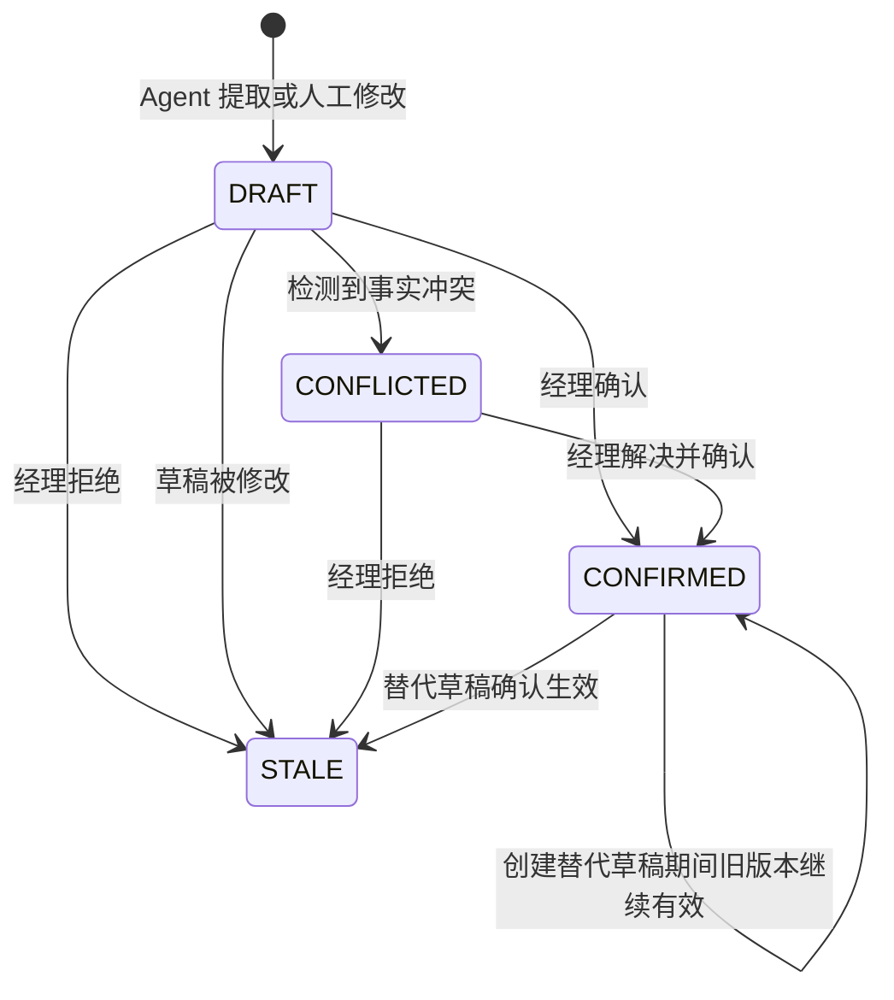
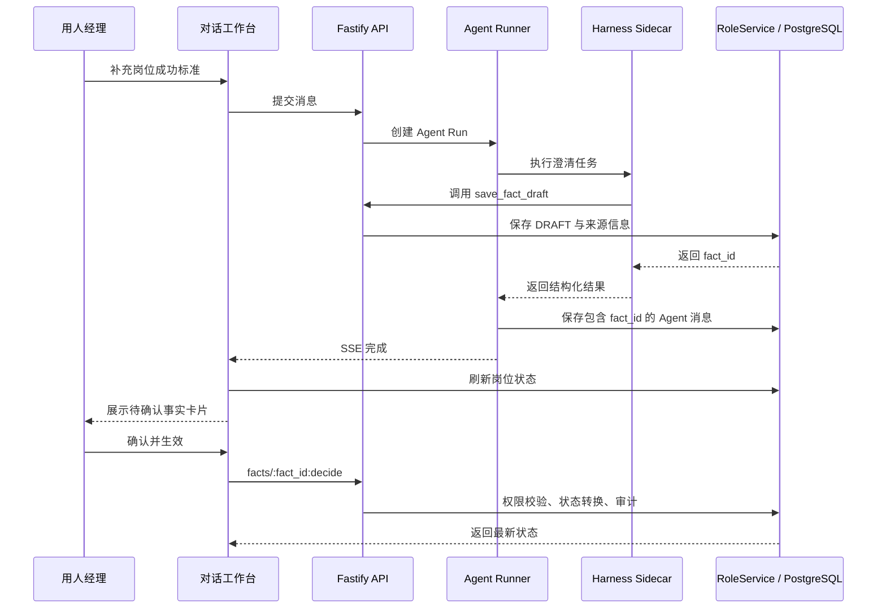
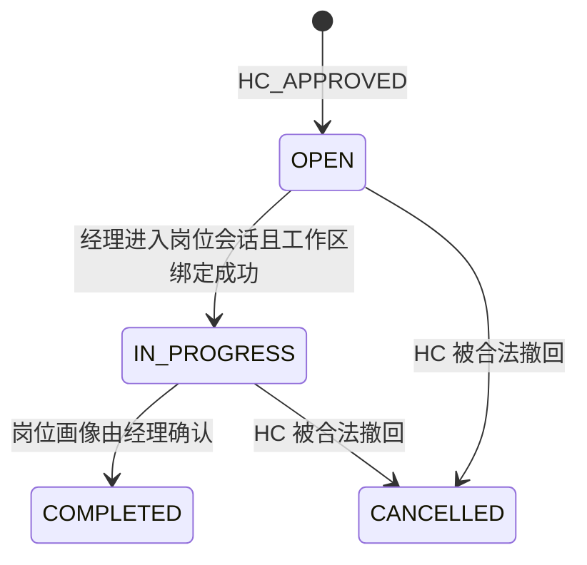

# 岗位画像澄清三闭环设计

> 状态：待用户审阅
> 日期：2026-08-18
> 范围：融合设计三个闭环——澄清事实确认与正式生效、模拟企业数据进入后端上下文检索、HC 审批后的主动提醒与任务触发。

## 1. 目标

本设计补齐岗位画像澄清从“审批通过”到“正式产物生效”的三个业务闭环：

1. **任务闭环**：HC 审批通过后，后端主动创建岗位澄清任务，通过站内状态和飞书单聊提醒对应的用人经理。
2. **上下文闭环**：模拟企业数据不再只是前端展示或静态文案，而是进入 PostgreSQL，由后端按租户、权限、岗位和任务进行真实检索，再作为有来源的上下文注入 Agent Run。
3. **事实闭环**：Agent 从对话中提取的岗位信息，不再停留在“模型已经听懂，但系统没有正式采用”的模糊状态，而是形成可查看、可修改、可拒绝、可追溯的企业事实。

三个闭环共同解决一个问题：让正确的人在正确的时间收到任务，让 Agent 在正确的权限范围内获得企业依据，再让人类确认哪些内容可以成为正式招聘标准。

### 1.1 前端改动硬约束

本轮以后端闭环为主，前端只能做三处局部增强：

1. 现有 HC 卡片增加“待澄清 / 已提醒 / 进行中”小状态。
2. 现有对话消息下增加紧凑的事实确认卡。
3. 现有岗位页复用提示区显示待处理事实数量。

登录、左侧导航、岗位选择结构、整体对话布局、岗位画像正文、HR 共享工作区和管理端 Trace 位置保持不变。不新增独立任务中心、消息中心、知识库管理页或新的前端导航。

### 1.2 端到端结果

完整闭环是：

1. Mock HRIS 向后端发送 HC 审批完成事件。
2. 后端幂等创建岗位澄清任务，并立即生成飞书提醒投递任务。
3. 用人经理在飞书或现有 HC 页面看到待办，进入原有岗位会话。
4. Agent 发起首问前，后端检索当前岗位真正需要的企业知识并保存上下文快照。
5. 用人经理在对话中补充岗位信息，Agent 只提取事实草稿，不替人做最终决定。
6. 前端在对应对话下展示事实卡片，用人经理确认、修改或拒绝。
7. 只有确认后的事实才能进入正式岗位画像、面试评估方案、公开 JD 和 HR 招聘画像。
8. 已生效事实发生变化时，保留历史记录，并使受影响的旧产物失效，避免继续使用过期标准。
9. 岗位画像确认后，岗位澄清任务完成；HR 在站内看到进度，但不收到重复催办。

## 2. 当前问题

当前代码已经具备可复用基础：

- Agent 调用 `save_fact_draft` 后，会在岗位状态中新增 `DRAFT` 事实。
- 后端已有批量确认接口 `POST /api/v1/role-sessions/:id/facts:confirm`。
- 生成岗位画像时，任务投影只读取 `CONFIRMED` 事实。
- PostgreSQL 已有 `hc_approvals`，能够保存审批上下文和对应经理、HR、岗位会话关系。
- 当前 HC 选择页可以展示已审批 HC，并在经理选择后创建或恢复岗位会话。
- 已有飞书企业应用接入，支持事件验签、消息去重、身份映射、机器人单聊回复和卡片发送。
- Agent Run 与 Trace 已经区分实际身份、有效角色、短期会话和业务状态。

但三个闭环仍有断点：

- 前端没有展示事实草稿，也没有调用事实确认接口。
- 事实只记录了笼统来源，无法准确定位到哪条消息、哪次 Agent Run、由谁提出。
- 只有“确认”，没有“修改”和“拒绝”。
- 正式产物生成前没有明确提示尚有待确认事实，用户可能误以为刚才的回答已经被采用。
- 已确认事实改变后，缺少对旧岗位画像及下游产物的统一失效处理。
- Mock 企业数据主要来自迁移 Seed、前端演示数据或 `syncMockContext` 的固定写入，没有通用的企业知识表、检索请求、相关性排序和上下文快照。
- HC 已审批数据可以被页面读取，但没有独立审批事件入口、岗位澄清任务和事务型通知 Outbox；主动提醒仍依赖用户先打开页面。
- 现有飞书能力主要回复用户主动发来的消息，没有根据 HC 事件主动定位经理并发送提醒的可靠投递链路。

因此目前存在三条断链：

```text
HC 审批完成 → 只有数据库记录 → 经理不打开页面就不知道有任务

Mock 企业资料 → 固定文案或整包状态 → 没有按任务检索和来源快照

经理回答 → Agent 提取 DRAFT → 前端不可确认 → 正式生成只读取 CONFIRMED
                                      ↓
                         用户刚说的内容可能被静默忽略
```

## 3. 业务原则

### 3.1 Agent 提议，人类生效

Agent 可以识别、归纳和保存事实草稿，但不能把自己的理解直接变成企业正式标准。业务事实的确认权属于用人经理。

### 3.2 只确认关键事实，不确认每句话

只有会影响岗位画像和招聘执行的内容才形成事实卡片，例如：

- 招聘背景：为什么现在需要这个岗位。
- 招聘原因：要解决什么组织或业务问题。
- 成功标准：入职后 90 天、6 个月、12 个月要达成什么结果。
- 约束条件：地点、编制、协作边界、不能突破的限制。

问候、过程讨论、解释性话术和 Agent 的建议不需要确认。

### 3.3 新版本确认前，旧版本继续有效

如果经理修改一条已经生效的事实，系统先创建新的 `DRAFT`，旧事实仍保持 `CONFIRMED`。只有新事实再次被确认后，旧事实才变成 `STALE`。这样不会因为编辑到一半而让正式画像突然失去依据。

### 3.4 正式产物必须可追溯

正式岗位画像只能使用 `CONFIRMED` 事实。每条事实必须能追溯到原始对话、Agent Run、提出人、确认人和确认时间。

### 3.5 站内任务是事实源，飞书只是触达渠道

岗位澄清任务必须先在数据库中创建。飞书只负责通知经理“有一个任务需要处理”，发送失败不能让任务消失，也不能影响经理从 Web 继续处理。

### 3.6 先过滤权限，再做相关性检索

企业知识必须先按租户、角色可见范围、有效状态和有效期过滤，再按部门、岗位族、任务类型、标签和关键词排序。不能先全库检索再让模型自行判断哪些内容可见。

### 3.7 只注入必要上下文

Agent 每次只接收当前任务需要的 Top N 企业知识摘要，并携带来源 ID、版本和命中理由。不能把整家公司的 HR 数据一次性塞入 Prompt，也不能把候选人个人信息放进通用岗位上下文。

## 4. 事实确认交互方案比较

### 事实方案 A：对话内事实卡片逐条确认（采用）

Agent 回复后，紧接着展示本轮提取的事实卡片。经理可以就地确认、修改或拒绝。

优点：操作与原始语境在一起；确认成本低；容易理解 Agent 到底记录了什么；适合逐轮澄清。缺点：需要把 Agent Run、消息和事实准确关联起来。

### 事实方案 B：澄清结束后统一进入事实清单确认

所有草稿先集中到一个清单，经理最后批量处理。

优点：适合集中审阅。缺点：事实离开原始对话后理解成本更高，错误会积累到最后才暴露，也容易让用户误以为前面已经生效。

### 事实方案 C：经理用自然语言回复“确认”

继续让 Agent 理解“确认”“不是这个意思”等表达，再调用工具改变状态。

优点：界面简单。缺点：对象指代容易模糊；难以处理多条事实；审计证据弱；模型不应代替权限明确的正式确认操作。

事实确认采用事实方案 A，同时在岗位详情保留“待确认事实数量”和统一查看入口。后续可在不改变领域逻辑的情况下补充事实方案 B，但不采用事实方案 C 作为正式生效入口。这里的事实交互方案编号，与下一节三个闭环采用的总体 B 方案不是同一组选项。

## 5. 三闭环总体架构

三个闭环总体采用已确认的 B 方案“轻量事件闭环”：复用现有 Fastify API、PostgreSQL、Agent Runner、Harness Sidecar、React 工作台和飞书企业应用，只增加边界清晰的后端服务与数据表。

```mermaid
flowchart LR
    HRIS["Mock HRIS<br/>HC 审批事件"] --> Intake["HC Event Intake<br/>验签与幂等"]
    Intake --> DB[("PostgreSQL")]
    DB --> Task["岗位澄清任务"]
    DB --> Outbox["通知 Outbox"]
    Outbox --> Dispatcher["API 内轻量调度器"]
    Dispatcher --> Feishu["飞书单聊提醒"]
    Task --> ExistingUI["现有 HC 卡片状态"]
    Feishu --> ExistingUI
    ExistingUI --> Conversation["现有岗位会话"]
    Conversation --> Retriever["企业上下文检索"]
    Retriever --> Knowledge[("企业知识条目")]
    Retriever --> Snapshot["本次上下文快照"]
    Snapshot --> Runner["Agent Runner / Harness"]
    Runner --> Draft["事实草稿 DRAFT"]
    Draft --> FactCard["对话内事实确认卡"]
    FactCard --> Confirmed["正式事实 CONFIRMED"]
    Confirmed --> Artifacts["岗位画像及下游产物"]
```



### 5.1 新增后端边界

- `HcEventIntakeService`：验签、事件幂等、更新审批记录。
- `ClarificationTaskService`：建立、开始、完成岗位澄清任务。
- `NotificationOutboxDispatcher`：领取待投递记录、发送飞书、失败重试。
- `EnterpriseContextRetriever`：权限过滤、相关性排序和上下文快照。
- `FactDecisionService`：确认、修改、拒绝事实并处理产物失效。

这些能力以服务和存储接口隔离，不继续堆入 `App.jsx`、`RoleService` 或 `FeishuGateway` 的单个大文件。各服务通过稳定类型交互，便于单独测试和后续替换 Mock 数据源。

### 5.2 不新增的基础设施

- 不新增独立向量数据库；第一期使用 PostgreSQL 结构化元数据和确定性相关性评分。
- 不新增消息队列服务；使用 PostgreSQL 事务型 Outbox 和 API 服务内轻量调度器。
- 不新增 Railway 服务；继续保持 `web + api + harness-sidecar + PostgreSQL` 拓扑。
- 不新增前端工作流引擎或全局任务中心。

### 5.3 三种状态各自负责什么

- 岗位澄清任务回答“现在该由谁处理”。
- 企业上下文快照回答“Agent 本轮依据了哪些企业知识”。
- 岗位事实状态回答“哪些内容已经获得人类授权，可以成为正式招聘标准”。

三种状态通过 `tenant_id`、`hc_request_id`、`role_session_id`、`agent_run_id` 和来源 ID 关联，但不揉成一个无法独立演进的 Agent 状态对象。

## 6. 闭环一：事实确认用户体验

### 6.1 对话中的事实卡片

示例：

```text
[成功标准 · 待确认]
入职 90 天内完成产品路线图，并推动一个核心客户进入试点。

来源：本轮对话 · 由岗位画像澄清 Agent 提取

[确认并生效] [修改] [拒绝]
```

卡片至少展示：

- 中文事实分类。
- 事实内容。
- 当前状态：待确认、已生效、有冲突、已失效。
- 来源消息。
- 提出人与提出时间。
- 确认人和确认时间（生效后）。
- 当前用户可执行的操作。

### 6.2 三种操作

**确认并生效**

- 将 `DRAFT` 改为 `CONFIRMED`。
- 记录确认人、确认时间和审计事件。
- 后续正式产物生成可以读取该事实。

**修改**

- 在卡片内打开编辑区域，允许修改事实分类和表述。
- 修改待确认事实：原草稿变为 `STALE`，生成一个新的 `DRAFT`。
- 修改已生效事实：生成一个新的 `DRAFT`，旧事实在新版本确认前继续有效。
- 新版本确认后，旧事实变为 `STALE`，受影响的旧产物失效。

**拒绝**

- 待确认事实变为 `STALE`，不再进入正式上下文。
- 可填写简短原因，便于审计和后续改进 Agent 提取规则。
- 拒绝从未生效的草稿，不影响现有正式产物。

### 6.3 不同角色看到的界面

- 用人经理：可以确认、修改、拒绝本岗位的事实。
- HR：可以查看事实、来源和状态，但只能补充意见，不能替经理让业务事实生效。
- 企业管理员：可以在测试角色模式下验证经理流程；审计中同时保留真实管理员身份与模拟的经理身份。
- Agent：只生成草稿、解释依据和提醒待办，不拥有正式确认权限。

## 7. 事实领域状态设计

沿用现有事实状态，不新增一套平行状态：

| 状态 | 含义 | 是否进入正式生成上下文 |
|---|---|---|
| `DRAFT` | Agent 或人工提出，等待经理决定 | 否 |
| `CONFIRMED` | 已由有权限的人确认，正式生效 | 是 |
| `CONFLICTED` | 与其他事实存在待解决冲突 | 否 |
| `STALE` | 已拒绝或已被新版本替代，仅保留历史 | 否 |

状态转换：



## 8. 事实数据模型

在现有 `Fact` 上增加可选字段，并为历史 JSON 数据提供默认值，不要求破坏性数据库迁移：

```ts
type Fact = {
  id: string
  category: FactCategory
  statement: string
  source: string
  status: 'DRAFT' | 'CONFIRMED' | 'CONFLICTED' | 'STALE'
  evidence_refs: string[]
  visible_to: 'ALL' | 'HR_ONLY'
  updated_at: string

  source_message_id?: string | null
  source_run_id?: string | null
  proposed_by_user_id?: string | null
  confirmed_by_user_id?: string | null
  confirmed_at?: string | null
  supersedes_fact_id?: string | null
  decision_reason?: string | null
}
```

设计说明：

- `source_message_id` 和 `source_run_id` 用于从事实回到原始上下文。
- `proposed_by_user_id` 记录是谁提供了业务输入，不等同于执行提取的 Agent。
- `confirmed_by_user_id` 与 `confirmed_at` 证明何时正式生效。
- `supersedes_fact_id` 串联事实版本。
- `decision_reason` 记录拒绝或修改原因。
- MVP 继续把事实保存于 `role_sessions.business_state` JSONB；确认、修改、拒绝事件写入现有 `audit_logs`，不新增事实决策表。

## 9. 事实决策接口设计

### 9.1 新增统一决策接口

```http
POST /api/v1/role-sessions/:id/facts/:fact_id:decide
```

请求：

```json
{
  "decision": "CONFIRM | REVISE | REJECT",
  "expected_revision": 12,
  "reason": "可选原因",
  "replacement": {
    "category": "SUCCESS_CRITERION",
    "statement": "修改后的事实内容"
  }
}
```

规则：

- `REVISE` 必须提供 `replacement`。
- `CONFIRM` 和 `REJECT` 不接受 `replacement`。
- 使用现有 `expected_revision` 做乐观锁，避免两个人同时操作覆盖结果。
- 返回最新 `RoleState` 和本次被处理的事实。
- 已有批量确认接口暂时保留以兼容旧调用；新前端统一使用决策接口。

### 9.2 前端 API Client

增加 `decideFact(roleSessionId, factId, payload)`，统一处理：

- 403：没有确认权限。
- 404：事实不存在或不属于当前租户/岗位。
- 409：岗位状态已被别人更新，需要刷新后重试。
- 422：修改内容或状态转换不合法。

## 10. Agent 与事实卡片的关联

事实卡片不能依赖前端对自然语言做二次解析，必须由后端返回稳定标识。

建议流程：

1. 用户消息入库，创建 Agent Run。
2. Agent 调用 `save_fact_draft`。
3. 内部工具路由把当前 `input_message_id`、`run_id` 和实际提问用户传给 `RoleService.saveFactDraft`。
4. 服务创建事实并把 `fact_id` 返回给工具。
5. `AgentRunner` 持久化最终 Agent 消息时，在 `structured_content` 中写入本轮关联的 `fact_id`、分类和状态。
6. 前端收到 SSE 完成事件后刷新岗位状态，并按 `fact_id` 渲染卡片。



异常恢复要求：即使模型最终回答结构校验失败，只要 `save_fact_draft` 已成功，事实仍然必须能通过 `source_run_id` 被恢复并显示，不能成为看不见的草稿。

## 11. 正式生成门禁

当前正式生成只读取 `CONFIRMED` 事实，但还需要避免“静默忽略”。

在执行 `GENERATE_ROLE_PROFILE` 前增加门禁：

- 存在 `DRAFT` 或 `CONFLICTED` 事实时，阻止生成。
- 返回稳定错误码 `UNRESOLVED_FACTS_PENDING`。
- 响应中包含待处理数量和事实 ID，但不泄露当前角色不可见的事实内容。
- 前端提示“还有 2 条岗位事实待确认”，并提供返回对话定位入口。
- `STALE` 事实不阻塞生成。

正式生成任务仍只投影 `CONFIRMED` 事实，从机制上保证 Agent 无法绕过人工确认。

## 12. 正式产物失效规则

事实第一次被确认，或者替代版本被确认后，如果岗位已经存在正式产物，需要让受影响产物失效：

1. 岗位画像 `ROLE_PROFILE` 失效。
2. 依赖岗位画像的评估方案、公开 JD、HR 招聘画像一并失效。
3. 历史版本保留，只把最新引用状态标记为 `INVALIDATED`。
4. 记录触发失效的事实 ID、新旧事实版本和操作人。
5. 前端明确提示需要重新生成和重新确认，不能继续把旧产物显示为有效。

拒绝从未生效的草稿不触发失效。修改已确认事实但替代草稿尚未确认时，也不触发失效。

本阶段不新增岗位主流程 Stage；岗位是否需要重做由 `latest_artifacts` 的状态表达，避免同时维护两套互相冲突的状态机。

## 13. 权限、租户与审计

- 所有操作先按 `tenant_id + role_session_id` 查找，跨租户统一表现为 404。
- 经理必须是岗位成员或拥有当前岗位的经理权限。
- HR 不得调用确认、修改、拒绝接口。
- 管理员以测试经理身份操作时，权限按有效角色判断；审计同时记录真实角色、测试角色和真实用户。
- 审计事件至少包括：`FACT_CONFIRMED`、`FACT_REVISED`、`FACT_REJECTED`、`ARTIFACTS_INVALIDATED_BY_FACT`。
- 审计详情不重复保存无关个人信息和完整提示词。

## 14. 事实并发、幂等与错误处理

- 每次决策携带 `expected_revision`，Revision 不一致返回 409，并让前端刷新事实状态。
- 对同一事实重复提交相同最终决定时，可返回当前最新状态，不重复产生替代事实和失效事件。
- 已经 `STALE` 的事实不能再次确认。
- 已经 `CONFIRMED` 的事实再次确认不重复触发产物失效。
- 替代同一事实只能存在一个当前可操作草稿；重复修改需要基于最新草稿继续生成新版本。
- 服务端状态更新、产物失效和审计写入应在同一事务中完成；任何一步失败都不应留下部分生效状态。

## 15. 事实闭环验收场景

### 场景一：确认新事实

1. 经理回答“入职 90 天内完成产品路线图，并推动一个核心客户进入试点”。
2. Agent 回复下方出现“成功标准 · 待确认”卡片。
3. 经理点击确认，卡片显示确认人和确认时间。
4. 数据中的事实状态为 `CONFIRMED`。
5. 生成岗位画像后，Trace 的输入投影包含该事实，画像成功结果能追溯到它。

### 场景二：拒绝错误提取

1. Agent 对经理表达产生错误归纳。
2. 经理拒绝并填写原因。
3. 事实状态为 `STALE`，正式生成不使用它，也不因此使已有产物失效。

### 场景三：修改已生效事实

1. 经理修改一条 `CONFIRMED` 事实。
2. 系统创建替代 `DRAFT`，旧事实继续有效。
3. 替代事实确认后，旧事实变成 `STALE`。
4. 原岗位画像和下游产物被标记失效，页面提示重新生成。

### 场景四：角色边界

1. HR 能看到事实及其状态。
2. HR 尝试确认时收到 403。
3. 管理员以经理测试角色确认成功。
4. Trace 与审计能同时看出实际操作者是管理员、有效角色是经理。

### 场景五：并发与历史兼容

1. 两个页面同时处理同一事实，旧 Revision 的请求收到 409，不覆盖新结果。
2. 旧岗位中没有新增来源字段的事实仍能正常解析和展示。
3. 已有岗位、HC、对话、画像版本和审计数据不被迁移覆盖。

## 16. 事实闭环测试范围

### 合约测试

- 新增字段对历史 `Fact` JSON 向后兼容。
- 决策请求三种类型的条件校验正确。
- `DRAFT → CONFIRMED/STALE`、替代关系和非法状态转换符合约束。

### 服务与 API 测试

- 确认、修改、拒绝分别写入正确状态和审计记录。
- 替代已确认事实时，旧事实直到新版本确认前仍有效。
- 新版本确认后，岗位画像及下游产物全部失效。
- 权限、岗位成员关系、租户隔离和管理员测试角色正确。
- Revision 冲突、重复提交、事实不存在和非法输入返回稳定错误。
- 存在待确认或冲突事实时，岗位画像生成被阻止；全部处理后可以生成。

### Agent Runner 测试

- `save_fact_draft` 返回的 `fact_id` 被写入 Agent 消息结构化内容。
- 事实记录包含正确的消息、Run 和提出人来源。
- Agent 最终输出失败时，已经保存的事实仍能被前端恢复。

### 前端测试

- 不同状态的事实卡片展示正确。
- 经理、HR、管理员测试角色看到的操作权限正确。
- 确认、修改、拒绝调用正确接口并刷新当前状态。
- 409 后提示刷新，不能用旧状态覆盖新事实。
- 正式生成按钮能展示待确认数量并定位到对应卡片。

### 回归与线上验收

- 旧岗位和旧事实正常展示。
- 对话、SSE、岗位详情、产物确认和 Trace 不受影响。
- Railway 上分别使用经理、HR、管理员账号完成核心验收场景。

## 17. 闭环二：模拟企业数据进入后端上下文检索

### 17.1 数据边界

第一期只纳入不含候选人个人隐私的企业知识：

- 组织架构与部门职责。
- 职级体系与岗位族定义。
- 历史 JD。
- 已脱敏的相似岗位画像与成功标准。
- 招聘制度与岗位画像规范。
- 通用面试标准与题型规范。

候选人简历、姓名、联系方式、评价原文和其他个人数据不进入通用企业知识检索。候选人证据继续留在现有岗位级候选人链路中，只能按岗位和权限访问。

### 17.2 企业知识数据模型

新增 `enterprise_knowledge_items` 表，Mock 公司数据也必须通过同一 Store 接口进入该表，不能继续让前端静态数据充当 Agent 上下文。

```ts
type EnterpriseKnowledgeItem = {
  id: string
  tenant_id: string
  category:
    | 'ORGANIZATION'
    | 'JOB_FAMILY'
    | 'LEVEL_FRAMEWORK'
    | 'HISTORICAL_JD'
    | 'ROLE_PROFILE_CASE'
    | 'RECRUITING_POLICY'
    | 'INTERVIEW_STANDARD'
  title: string
  content: string
  summary: string
  department: string | null
  job_family: string | null
  tags: string[]
  visible_to: 'ALL_ROLE_MEMBERS' | 'HR_ONLY' | 'ADMIN_ONLY'
  source_ref: string
  source_version: string
  status: 'ACTIVE' | 'ARCHIVED'
  valid_from: string
  valid_to: string | null
  updated_at: string
}
```

必要索引：

- `tenant_id + status + category`，用于租户和知识类型硬过滤。
- `tenant_id + department` 与 `tenant_id + job_family`，用于岗位范围过滤。
- `source_ref + source_version` 唯一约束，避免 Seed 或同步重复写入同一知识版本。
- `tags` 使用 PostgreSQL GIN 索引；第一期不依赖中文全文检索扩展或向量扩展。

### 17.3 检索请求与结果

`EnterpriseContextRetriever` 是后端内部服务，不向浏览器开放任意搜索接口。

```ts
type EnterpriseContextQuery = {
  tenant_id: string
  actor_role: 'MANAGER' | 'HR' | 'ADMIN'
  role_session_id: string
  task: AgentTask
  department: string
  job_family: string | null
  query_terms: string[]
  top_k: number
}

type EnterpriseContextHit = {
  knowledge_id: string
  category: EnterpriseKnowledgeItem['category']
  title: string
  summary: string
  source_ref: string
  source_version: string
  relevance_score: number
  match_reasons: string[]
}
```

`tenant_id` 和 `actor_role` 必须从服务端身份与岗位状态推导，不能接受前端直接指定。

### 17.4 确定性检索流程

检索分为两步：

1. **硬过滤**：租户一致、状态为 `ACTIVE`、当前时间在有效期内、当前角色可见。
2. **相关性排序**：按任务所需知识类别、部门、岗位族、标签命中和关键词子串命中计算分数。

相同分数按 `updated_at` 倒序、`id` 升序稳定排序。每次最多注入 6 条，总摘要不超过约 4,000 个中文字符。这样可以在不引入向量数据库的情况下得到可测试、可解释的中文检索结果。

任务与知识类型的第一期映射：

| Agent 任务 | 优先检索知识 |
|---|---|
| `CLARIFY_MESSAGE` | 组织职责、岗位族、职级体系、相似岗位画像 |
| `GENERATE_ROLE_PROFILE` | 组织职责、岗位族、职级体系、相似岗位画像、招聘制度 |
| `GENERATE_ASSESSMENT` | 面试标准、招聘制度 |
| `GENERATE_PUBLIC_JD` | 岗位族、招聘制度 |
| `GENERATE_HR_BRIEF` | 历史 JD、相似岗位画像、招聘制度 |

### 17.5 上下文注入与 Trace

检索发生在 `AgentRunner` 构建任务投影时，先使用岗位的 HC、部门、已确认事实和当前任务构造查询，再把命中结果加入独立的 `enterprise_context` 层。

每次 Agent Run 必须保存：

- 查询使用的岗位、部门、任务和规范化关键词。
- 命中知识的 ID、来源、版本、分数和命中理由。
- 最终注入模型的摘要文本与截断情况。

这些内容通过现有 Agent Run Event / Trace 存储，不新增一套平行 Trace。模型生成内容中的 `evidence_refs` 可以引用 `source_ref`，但模型不能把检索结果自动升级为已确认岗位事实。

### 17.6 无结果和异常降级

- 没有命中时，Agent 继续使用 HC 与已确认岗位事实，并明确记录“未检索到相关企业依据”。
- 检索服务异常时，本轮 Run 可以降级继续，但必须写入 `context.retrieval_failed` 事件；生成正式产物时页面提示企业上下文未完整加载。
- 跨租户、角色不可见和已过期知识不得进入命中集合或 Trace 内容。
- 检索结果只能作为回答依据或待确认建议，不能绕过事实确认直接写入正式产物。

### 17.7 Mock 企业知识初始化

Mock 公司 Seed 覆盖上述七类知识，并使用稳定 `source_ref` 和版本。开发内存 Store 与 PostgreSQL Store 使用同一合约和同一批 Seed 构造器，避免本地演示与 Railway 数据形态不同。

迁移只新增数据表、索引和缺失 Seed；使用 `ON CONFLICT DO NOTHING` 或按版本幂等更新，不覆盖线上已有岗位、HC、对话、事实、产物、候选人和审计记录。

## 18. 闭环三：HC 审批后的主动提醒与任务触发

### 18.1 触发方式

新增 Mock HRIS 服务端事件入口：

```http
POST /api/v1/integrations/mock-hris/hc-events
```

事件至少包含：

```json
{
  "event_id": "evt-hc-2026-001-approved",
  "event_type": "HC_APPROVED",
  "occurred_at": "2026-08-18T01:00:00.000Z",
  "tenant_id": "tenant-demo",
  "hc": {
    "request_id": "HC-2026-NEW-001",
    "title": "企业产品经理",
    "department": "企业服务产品部",
    "hiring_manager_user_id": "manager-demo",
    "assigned_hr_user_id": "hr-demo",
    "context": {}
  }
}
```

入口使用独立服务端密钥校验签名和时间戳；不使用用户 Cookie，也不接受前端页面模拟身份。`event_id` 通过现有外部事件收据机制幂等去重。

### 18.2 事务内创建三类记录

首次收到合法 `HC_APPROVED` 事件时，在同一个数据库事务中：

1. 插入或幂等更新 `hc_approvals`。
2. 创建唯一岗位澄清任务 `role_clarification_tasks`。
3. 创建一条飞书提醒 `notification_outbox`。

任何一步失败都整体回滚，避免出现“有 HC 没任务”或“发了通知但数据库没有任务”。重复事件返回已处理结果，不重复建任务或发提醒。

### 18.3 岗位澄清任务模型

```ts
type RoleClarificationTask = {
  id: string
  tenant_id: string
  hc_request_id: string
  role_session_id: string | null
  assignee_user_id: string
  status: 'OPEN' | 'IN_PROGRESS' | 'COMPLETED' | 'CANCELLED'
  due_at: string | null
  started_at: string | null
  completed_at: string | null
  created_at: string
  updated_at: string
}
```

唯一约束为 `tenant_id + hc_request_id`。状态变化：



第一期只接收 `HC_APPROVED`；`CANCELLED` 作为领域兼容状态保留，不开放无来源的前端取消操作。

### 18.4 站内状态派生

现有 `GET /api/v1/hc-approvals` 在每条 HC 上增加任务摘要和通知摘要。前端小状态按后端数据派生：

- 任务 `OPEN` 且飞书尚未成功：`待澄清`。
- 任务 `OPEN` 且飞书已成功：`已提醒`。
- 任务 `IN_PROGRESS`：`进行中`。
- 任务 `COMPLETED`：继续使用现有画像阶段/版本状态，不新增第四种小标签。

HR 通过现有已审批岗位页面查看任务进度，不新增 HR 任务页面，也不发送重复飞书催办。

### 18.5 飞书身份绑定

现有 `FEISHU_USER_MAPPINGS_JSON` 继续用于部署期配置，但主动提醒需要稳定的反向绑定。新增 `user_channel_bindings`：

```ts
type UserChannelBinding = {
  tenant_id: string
  user_id: string
  channel: 'FEISHU'
  recipient_type: 'OPEN_ID'
  recipient_id: string
  status: 'ACTIVE' | 'REVOKED'
  verified_at: string
}
```

绑定可以在管理员部署配置同步时建立，也可以在已映射用户首次给机器人发送消息时幂等更新。主动提醒必须由 HC 的 `hiring_manager_user_id` 反查唯一 `ACTIVE` 绑定；找不到时标记 `UNBOUND`，绝不猜测或发送给 HR、管理员或其他经理。后续建立有效绑定时，只重新排队该用户尚未发送的 `UNBOUND` 记录。

### 18.6 通知 Outbox 与重试

```ts
type NotificationOutboxRecord = {
  id: string
  tenant_id: string
  dedupe_key: string
  channel: 'FEISHU'
  recipient_user_id: string
  template: 'HC_CLARIFICATION_ASSIGNED'
  payload: Record<string, unknown>
  status: 'PENDING' | 'PROCESSING' | 'SENT' | 'RETRY' | 'UNBOUND' | 'DEAD'
  attempt_count: number
  next_attempt_at: string
  last_error_code: string | null
  sent_at: string | null
}
```

API 服务中的轻量 Dispatcher 使用数据库行锁领取到期记录，避免多实例重复发送。初始提醒立即发送；技术失败后按 1 分钟、5 分钟、30 分钟重试，累计 4 次仍失败则进入 `DEAD` 并记录审计。本阶段不做每天重复催办，避免骚扰经理。

飞书卡片包含岗位名称、部门、HC 单号、审批原因摘要和“开始岗位澄清”按钮。按钮跳转现有 Web HC/岗位入口；服务端仍重新校验登录、租户和岗位成员关系，飞书链接本身不授予权限。

### 18.7 与现有岗位会话衔接

经理点击现有 HC 卡片或飞书按钮后，继续调用现有 `POST /api/v1/hc-approvals/:request_id/workspace`：

- 第一次进入：幂等创建岗位会话、绑定 HC 与岗位成员，工作区绑定成功后任务改为 `IN_PROGRESS`，随后提交首问 Agent Run。
- 再次进入：恢复同一个岗位会话，不重复创建首问和任务。
- 岗位画像由经理确认：任务改为 `COMPLETED`。

工作区绑定与任务开始应由同一个 Store 原子操作完成；首问提交失败时任务仍为 `IN_PROGRESS`，页面显示可重试错误，并在下次进入时只补提首问，不重复创建岗位或任务。

### 18.8 飞书失败降级

- 飞书未配置、无绑定、权限不足或限流都不能删除或回滚站内任务。
- 站内 HC 卡片始终基于任务表显示真实状态。
- 通知失败只在服务端日志、审计和管理 Trace 中展示，不给普通用户暴露 App Secret、Open ID 或原始响应。
- 飞书恢复后可以由 Dispatcher 自动重试到期记录；`DEAD` 记录需要运维显式重放，不能无限循环。

## 19. 三闭环权限与协作

| 参与者 | HC 任务 | 企业知识 | 事实确认 | 正式产物 |
|---|---|---|---|---|
| 用人经理 | 接收站内和飞书提醒，开始并完成澄清 | 读取岗位相关且允许经理查看的知识 | 确认、修改、拒绝业务事实 | 确认岗位画像、评估方案和 JD |
| HR | 在现有共享岗位中查看进度，不接收重复催办 | 可读取招聘制度、历史 JD 等 HR 可见知识 | 查看事实并补充意见，不能让业务事实生效 | 生成和使用 HR 招聘画像 |
| 企业管理员 | 查看任务、通知、检索和 Trace；管理部署配置 | 按管理员权限审计企业知识 | 可用测试经理角色验收，保留真实身份 | 审计版本和权限边界 |
| Agent | 根据任务工作，不拥有任务分配权 | 只读取服务端检索后的上下文快照 | 只提出 `DRAFT` | 只生成草稿，不确认或发布 |

HC、岗位会话、知识、任务、通知、事实和产物都必须带租户边界。普通用户不能通过请求参数伪造 `tenant_id`、`actor_role`、`test_role` 或飞书接收人。

## 20. 前端小改设计

### 20.1 HC 卡片状态

只修改现有 `HcApprovalLanding` 的卡片元信息区域，增加一个紧凑状态标签。卡片结构、筛选方式、进入岗位动作和整体样式不变。

### 20.2 对话事实确认卡

在现有 Agent 消息结构内部追加 `FactDecisionCard`，不新建右侧面板或独立页面。卡片默认折叠为一条事实摘要；只有点击“修改”才展开输入区域，避免对话区高度明显膨胀。

### 20.3 岗位页待处理数量

复用现有岗位状态提示区显示“还有 N 条事实待确认”，点击返回对话并定位第一条待确认卡。岗位画像正文、子导航和各产物组件不变。

### 20.4 明确禁止的前端改动

- 不调整登录页和账号体系。
- 不重排左侧导航、会话列表和主内容区。
- 不新增任务中心、通知中心或企业知识后台。
- 不修改岗位画像、评估方案、公开 JD 和 HR 招聘画像正文布局。
- 不拆分经理与 HR 的共享岗位会话。
- 不移动或重构管理端 Trace 控制台。

## 21. 分阶段发布、测试与回滚

### 阶段一：数据底座

- 新增企业知识、岗位澄清任务、飞书绑定和通知 Outbox 表。
- 扩展 Store 接口与内存/PostgreSQL 实现。
- 添加幂等 Mock 企业知识 Seed。
- 验证迁移不会改写现有岗位、HC、消息、产物、候选人和审计数据。

此阶段前端零变化。

### 阶段二：HC 事件与通知闭环

- 实现 Mock HRIS 事件验签、事件去重和事务内建任务。
- 实现 Dispatcher、飞书 `open_id` 主动发送、绑定与重试。
- 扩展 HC 列表返回任务/通知摘要。
- 用 API 和数据库先验证重复事件、无绑定、飞书失败与多实例领取。

### 阶段三：企业上下文检索

- 实现确定性过滤与排序。
- 接入 Agent 任务投影与 Trace。
- 验证不同任务、角色和租户只命中允许的知识。
- 验证无结果和异常降级不会让模型补造企业制度。

### 阶段四：事实正式生效

- 扩展事实来源和版本字段。
- 实现统一事实决策接口、权限、并发和幂等规则。
- 实现正式生成门禁与下游产物失效。
- 先完成合约、领域、API 和 Agent Runner 测试。

### 阶段五：三处前端小改

- HC 卡片小状态。
- 对话内事实确认卡。
- 岗位页待处理数量。
- 浏览器检查桌面与窄屏不溢出，并确认其他页面视觉无回归。

### 21.1 自动化验证

至少执行：

```bash
git diff --check
corepack pnpm typecheck
corepack pnpm test
corepack pnpm build
```

新增测试必须覆盖：

- 迁移、旧 JSON 与历史岗位兼容。
- HC 事件验签、幂等、事务回滚和重复投递。
- 通知领取、重试、`UNBOUND`、`DEAD` 和飞书降级。
- 企业知识租户隔离、角色可见性、有效期、稳定排序和 Top N 限制。
- 上下文快照进入 Agent Run 与 Trace。
- 事实确认、修改、拒绝、并发冲突、生成门禁和产物失效。
- 经理、HR、管理员测试角色的权限边界。
- 三处前端小改及现有页面回归。

### 21.2 Railway 线上验收

1. 备份或只读核验现有 PostgreSQL 数据，确认迁移只做增量变更。
2. 发送一条新的 Mock HC 审批事件。
3. 确认经理收到飞书提醒，站内 HC 显示“已提醒”。
4. 经理进入原岗位会话，任务变为“进行中”并收到首问。
5. 确认 Trace 显示本轮真实命中的企业知识来源、版本和命中理由。
6. 经理确认事实后生成岗位画像，确认画像确实使用该事实。
7. HR 能查看任务进度和共享岗位，但不能确认业务事实。
8. 管理员 Trace 同时保留真实身份与有效测试角色。
9. 模拟飞书发送失败，确认站内任务仍存在且通知按规则重试。
10. 核验 `web`、`api`、`harness-sidecar` 和 PostgreSQL 原有拓扑与健康状态。

### 21.3 回滚

- 新表和新增字段保持向后兼容，不在回滚时删除已经产生的任务、通知、知识快照、事实版本或审计记录。
- Dispatcher 可通过环境开关停止主动发送，站内任务仍可继续使用。
- 企业检索可通过服务端开关降级为 HC 与已确认事实上下文。
- 前端可以独立回滚到旧版本；后端仍保留原批量确认接口，避免新旧版本短暂不一致。

## 22. 本阶段不做

- 不接入真实 HRIS 或 OA；第一期由 Mock HRIS 通过真实服务端事件协议驱动。
- 不新增独立向量数据库、消息队列或 Railway 服务。
- 不建立企业知识管理前端。
- 不把候选人个人数据放进通用企业知识检索。
- 不每天重复催办经理；第一期只发送一次业务提醒，并对技术失败重试。
- 不给 HR 发送同一 HC 的重复提醒。
- 不做自动语义冲突识别，只保留 `CONFLICTED` 状态及人工处理能力。
- 不让 Agent 通过自然语言替用户完成正式确认。
- 不确认每一句对话，也不把普通聊天保存成岗位事实。
- 不修改现有岗位画像正文和 HR 共享工作区布局。

## 23. 完成定义

三个闭环只有同时满足以下条件才算完成：

### 23.1 HC 任务闭环

- HC 审批事件不依赖用户打开网页即可创建唯一岗位澄清任务。
- 用人经理能收到飞书单聊提醒并在现有 HC 页面看到状态。
- 飞书失败不影响站内任务，重复事件不重复建任务或发通知。
- 经理进入会话后任务进入进行中，画像确认后任务完成。

### 23.2 企业上下文闭环

- Mock 企业知识真实保存在后端数据库，并通过统一 Store 查询。
- 每次检索先执行租户、权限和有效期过滤，再做可解释排序。
- Agent Run 与 Trace 能看到实际注入的知识来源、版本和命中理由。
- 无结果或检索失败时不会补造企业制度，也不会泄露候选人或跨租户数据。

### 23.3 事实正式生效闭环

- 用户能在原始对话旁看到 Agent 提取的事实。
- 有权限的经理能确认、修改、拒绝；HR 不能越权。
- 状态转换、来源、操作者和时间可审计。
- 未确认事实不会被正式产物使用，也不会被静默忽略。
- 已生效事实修改后有清晰版本关系，旧正式产物会正确失效。

### 23.4 前端与发布约束

- 前端只完成 HC 状态、事实卡片和待处理数量三处小改。
- 登录、导航、对话布局、岗位画像正文、HR 共享工作区和 Trace 位置没有发生结构性变化。
- 历史数据兼容，自动化检查通过，并完成经理、HR、管理员和飞书降级的 Railway 线上验收。
