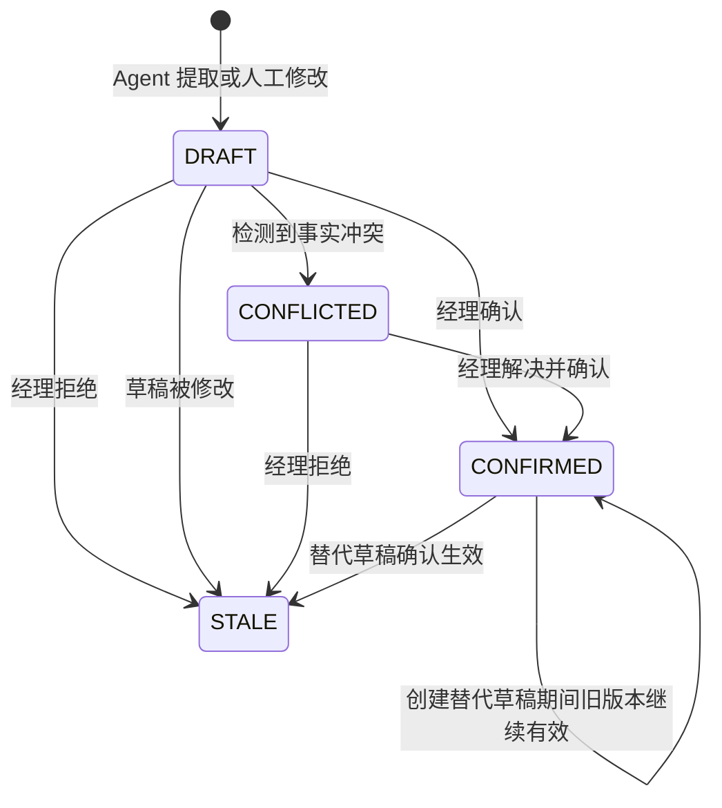
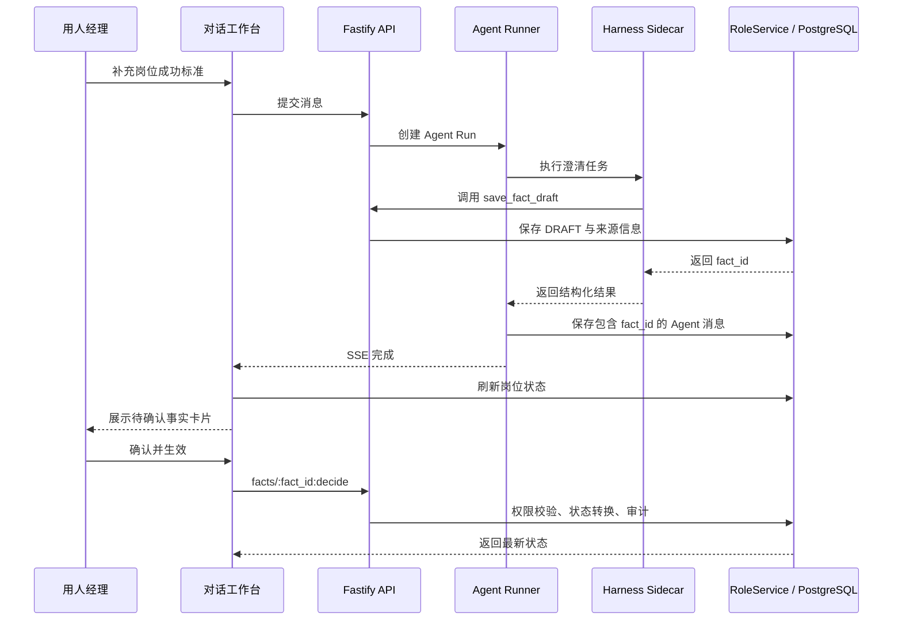

# 岗位事实确认与正式生效设计

> 状态：待用户审阅
> 日期：2026-08-18
> 范围：只设计“澄清事实的前端确认与正式生效”闭环；企业数据检索和 HC 审批主动提醒另行设计。

## 1. 目标

让 Agent 从对话中提取的岗位信息，不再停留在“模型已经听懂，但系统没有正式采用”的模糊状态，而是形成可查看、可修改、可拒绝、可追溯的企业事实。

完整闭环是：

1. 用人经理在对话中补充岗位信息。
2. Agent 只负责提取一条事实草稿，不替人做最终决定。
3. 前端在对应对话下展示事实卡片。
4. 用人经理确认、修改或拒绝这条事实。
5. 只有确认后的事实才能进入正式岗位画像、面试评估方案、公开 JD 和 HR 招聘画像。
6. 已生效事实发生变化时，保留历史记录，并使受影响的旧产物失效，避免继续使用过期标准。

## 2. 当前问题

当前代码已经具备一部分后端能力：

- Agent 调用 `save_fact_draft` 后，会在岗位状态中新增 `DRAFT` 事实。
- 后端已有批量确认接口 `POST /api/v1/role-sessions/:id/facts:confirm`。
- 生成岗位画像时，任务投影只读取 `CONFIRMED` 事实。

但当前闭环没有接通：

- 前端没有展示事实草稿，也没有调用事实确认接口。
- 事实只记录了笼统来源，无法准确定位到哪条消息、哪次 Agent Run、由谁提出。
- 只有“确认”，没有“修改”和“拒绝”。
- 正式产物生成前没有明确提示尚有待确认事实，用户可能误以为刚才的回答已经被采用。
- 已确认事实改变后，缺少对旧岗位画像及下游产物的统一失效处理。

因此目前存在这条断链：

```text
经理回答 → Agent 提取 DRAFT → 前端不可确认 → 正式生成只读取 CONFIRMED
                                      ↓
                         用户刚说的内容可能被静默忽略
```

## 3. 业务原则

### 3.1 Agent 提议，人类生效

Agent 可以识别、归纳和保存事实草稿，但不能把自己的理解直接变成企业正式标准。业务事实的确认权属于用人经理。

### 3.2 只确认关键事实，不确认每句话

只有会影响岗位画像和招聘执行的内容才形成事实卡片，例如：

- 招聘背景：为什么现在需要这个岗位。
- 招聘原因：要解决什么组织或业务问题。
- 成功标准：入职后 90 天、6 个月、12 个月要达成什么结果。
- 约束条件：地点、编制、协作边界、不能突破的限制。

问候、过程讨论、解释性话术和 Agent 的建议不需要确认。

### 3.3 新版本确认前，旧版本继续有效

如果经理修改一条已经生效的事实，系统先创建新的 `DRAFT`，旧事实仍保持 `CONFIRMED`。只有新事实再次被确认后，旧事实才变成 `STALE`。这样不会因为编辑到一半而让正式画像突然失去依据。

### 3.4 正式产物必须可追溯

正式岗位画像只能使用 `CONFIRMED` 事实。每条事实必须能追溯到原始对话、Agent Run、提出人、确认人和确认时间。

## 4. 方案比较

### 方案 A：对话内事实卡片逐条确认（采用）

Agent 回复后，紧接着展示本轮提取的事实卡片。经理可以就地确认、修改或拒绝。

优点：操作与原始语境在一起；确认成本低；容易理解 Agent 到底记录了什么；适合逐轮澄清。缺点：需要把 Agent Run、消息和事实准确关联起来。

### 方案 B：澄清结束后统一进入事实清单确认

所有草稿先集中到一个清单，经理最后批量处理。

优点：适合集中审阅。缺点：事实离开原始对话后理解成本更高，错误会积累到最后才暴露，也容易让用户误以为前面已经生效。

### 方案 C：经理用自然语言回复“确认”

继续让 Agent 理解“确认”“不是这个意思”等表达，再调用工具改变状态。

优点：界面简单。缺点：对象指代容易模糊；难以处理多条事实；审计证据弱；模型不应代替权限明确的正式确认操作。

本设计采用方案 A，同时在岗位详情保留“待确认事实数量”和统一查看入口。后续可在不改变领域逻辑的情况下补充方案 B，但不采用方案 C 作为正式生效入口。

## 5. 用户体验

### 5.1 对话中的事实卡片

示例：

```text
[成功标准 · 待确认]
入职 90 天内完成产品路线图，并推动一个核心客户进入试点。

来源：本轮对话 · 由岗位画像澄清 Agent 提取

[确认并生效] [修改] [拒绝]
```

卡片至少展示：

- 中文事实分类。
- 事实内容。
- 当前状态：待确认、已生效、有冲突、已失效。
- 来源消息。
- 提出人与提出时间。
- 确认人和确认时间（生效后）。
- 当前用户可执行的操作。

### 5.2 三种操作

**确认并生效**

- 将 `DRAFT` 改为 `CONFIRMED`。
- 记录确认人、确认时间和审计事件。
- 后续正式产物生成可以读取该事实。

**修改**

- 在卡片内打开编辑区域，允许修改事实分类和表述。
- 修改待确认事实：原草稿变为 `STALE`，生成一个新的 `DRAFT`。
- 修改已生效事实：生成一个新的 `DRAFT`，旧事实在新版本确认前继续有效。
- 新版本确认后，旧事实变为 `STALE`，受影响的旧产物失效。

**拒绝**

- 待确认事实变为 `STALE`，不再进入正式上下文。
- 可填写简短原因，便于审计和后续改进 Agent 提取规则。
- 拒绝从未生效的草稿，不影响现有正式产物。

### 5.3 不同角色看到的界面

- 用人经理：可以确认、修改、拒绝本岗位的事实。
- HR：可以查看事实、来源和状态，但只能补充意见，不能替经理让业务事实生效。
- 企业管理员：可以在测试角色模式下验证经理流程；审计中同时保留真实管理员身份与模拟的经理身份。
- Agent：只生成草稿、解释依据和提醒待办，不拥有正式确认权限。

## 6. 领域状态设计

沿用现有事实状态，不新增一套平行状态：

| 状态 | 含义 | 是否进入正式生成上下文 |
|---|---|---|
| `DRAFT` | Agent 或人工提出，等待经理决定 | 否 |
| `CONFIRMED` | 已由有权限的人确认，正式生效 | 是 |
| `CONFLICTED` | 与其他事实存在待解决冲突 | 否 |
| `STALE` | 已拒绝或已被新版本替代，仅保留历史 | 否 |

状态转换：



## 7. 数据模型

在现有 `Fact` 上增加可选字段，并为历史 JSON 数据提供默认值，不要求破坏性数据库迁移：

```ts
type Fact = {
  id: string
  category: FactCategory
  statement: string
  source: string
  status: 'DRAFT' | 'CONFIRMED' | 'CONFLICTED' | 'STALE'
  evidence_refs: string[]
  visible_to: 'ALL' | 'HR_ONLY'
  updated_at: string

  source_message_id?: string | null
  source_run_id?: string | null
  proposed_by_user_id?: string | null
  confirmed_by_user_id?: string | null
  confirmed_at?: string | null
  supersedes_fact_id?: string | null
  decision_reason?: string | null
}
```

设计说明：

- `source_message_id` 和 `source_run_id` 用于从事实回到原始上下文。
- `proposed_by_user_id` 记录是谁提供了业务输入，不等同于执行提取的 Agent。
- `confirmed_by_user_id` 与 `confirmed_at` 证明何时正式生效。
- `supersedes_fact_id` 串联事实版本。
- `decision_reason` 记录拒绝或修改原因。
- MVP 继续把事实保存于 `role_sessions.business_state` JSONB；确认、修改、拒绝事件写入现有 `audit_logs`，不新增事实决策表。

## 8. 接口设计

### 8.1 新增统一决策接口

```http
POST /api/v1/role-sessions/:id/facts/:fact_id:decide
```

请求：

```json
{
  "decision": "CONFIRM | REVISE | REJECT",
  "expected_revision": 12,
  "reason": "可选原因",
  "replacement": {
    "category": "SUCCESS_CRITERION",
    "statement": "修改后的事实内容"
  }
}
```

规则：

- `REVISE` 必须提供 `replacement`。
- `CONFIRM` 和 `REJECT` 不接受 `replacement`。
- 使用现有 `expected_revision` 做乐观锁，避免两个人同时操作覆盖结果。
- 返回最新 `RoleState` 和本次被处理的事实。
- 已有批量确认接口暂时保留以兼容旧调用；新前端统一使用决策接口。

### 8.2 前端 API Client

增加 `decideFact(roleSessionId, factId, payload)`，统一处理：

- 403：没有确认权限。
- 404：事实不存在或不属于当前租户/岗位。
- 409：岗位状态已被别人更新，需要刷新后重试。
- 422：修改内容或状态转换不合法。

## 9. Agent 与事实卡片的关联

事实卡片不能依赖前端对自然语言做二次解析，必须由后端返回稳定标识。

建议流程：

1. 用户消息入库，创建 Agent Run。
2. Agent 调用 `save_fact_draft`。
3. 内部工具路由把当前 `input_message_id`、`run_id` 和实际提问用户传给 `RoleService.saveFactDraft`。
4. 服务创建事实并把 `fact_id` 返回给工具。
5. `AgentRunner` 持久化最终 Agent 消息时，在 `structured_content` 中写入本轮关联的 `fact_id`、分类和状态。
6. 前端收到 SSE 完成事件后刷新岗位状态，并按 `fact_id` 渲染卡片。



异常恢复要求：即使模型最终回答结构校验失败，只要 `save_fact_draft` 已成功，事实仍然必须能通过 `source_run_id` 被恢复并显示，不能成为看不见的草稿。

## 10. 正式生成门禁

当前正式生成只读取 `CONFIRMED` 事实，但还需要避免“静默忽略”。

在执行 `GENERATE_ROLE_PROFILE` 前增加门禁：

- 存在 `DRAFT` 或 `CONFLICTED` 事实时，阻止生成。
- 返回稳定错误码 `UNRESOLVED_FACTS_PENDING`。
- 响应中包含待处理数量和事实 ID，但不泄露当前角色不可见的事实内容。
- 前端提示“还有 2 条岗位事实待确认”，并提供返回对话定位入口。
- `STALE` 事实不阻塞生成。

正式生成任务仍只投影 `CONFIRMED` 事实，从机制上保证 Agent 无法绕过人工确认。

## 11. 正式产物失效规则

事实第一次被确认，或者替代版本被确认后，如果岗位已经存在正式产物，需要让受影响产物失效：

1. 岗位画像 `ROLE_PROFILE` 失效。
2. 依赖岗位画像的评估方案、公开 JD、HR 招聘画像一并失效。
3. 历史版本保留，只把最新引用状态标记为 `INVALIDATED`。
4. 记录触发失效的事实 ID、新旧事实版本和操作人。
5. 前端明确提示需要重新生成和重新确认，不能继续把旧产物显示为有效。

拒绝从未生效的草稿不触发失效。修改已确认事实但替代草稿尚未确认时，也不触发失效。

本阶段不新增岗位主流程 Stage；岗位是否需要重做由 `latest_artifacts` 的状态表达，避免同时维护两套互相冲突的状态机。

## 12. 权限、租户与审计

- 所有操作先按 `tenant_id + role_session_id` 查找，跨租户统一表现为 404。
- 经理必须是岗位成员或拥有当前岗位的经理权限。
- HR 不得调用确认、修改、拒绝接口。
- 管理员以测试经理身份操作时，权限按有效角色判断；审计同时记录真实角色、测试角色和真实用户。
- 审计事件至少包括：`FACT_CONFIRMED`、`FACT_REVISED`、`FACT_REJECTED`、`ARTIFACTS_INVALIDATED_BY_FACT`。
- 审计详情不重复保存无关个人信息和完整提示词。

## 13. 并发、幂等与错误处理

- 每次决策携带 `expected_revision`，Revision 不一致返回 409，并让前端刷新事实状态。
- 对同一事实重复提交相同最终决定时，可返回当前最新状态，不重复产生替代事实和失效事件。
- 已经 `STALE` 的事实不能再次确认。
- 已经 `CONFIRMED` 的事实再次确认不重复触发产物失效。
- 替代同一事实只能存在一个当前可操作草稿；重复修改需要基于最新草稿继续生成新版本。
- 服务端状态更新、产物失效和审计写入应在同一事务中完成；任何一步失败都不应留下部分生效状态。

## 14. 验收场景

### 场景一：确认新事实

1. 经理回答“入职 90 天内完成产品路线图，并推动一个核心客户进入试点”。
2. Agent 回复下方出现“成功标准 · 待确认”卡片。
3. 经理点击确认，卡片显示确认人和确认时间。
4. 数据中的事实状态为 `CONFIRMED`。
5. 生成岗位画像后，Trace 的输入投影包含该事实，画像成功结果能追溯到它。

### 场景二：拒绝错误提取

1. Agent 对经理表达产生错误归纳。
2. 经理拒绝并填写原因。
3. 事实状态为 `STALE`，正式生成不使用它，也不因此使已有产物失效。

### 场景三：修改已生效事实

1. 经理修改一条 `CONFIRMED` 事实。
2. 系统创建替代 `DRAFT`，旧事实继续有效。
3. 替代事实确认后，旧事实变成 `STALE`。
4. 原岗位画像和下游产物被标记失效，页面提示重新生成。

### 场景四：角色边界

1. HR 能看到事实及其状态。
2. HR 尝试确认时收到 403。
3. 管理员以经理测试角色确认成功。
4. Trace 与审计能同时看出实际操作者是管理员、有效角色是经理。

### 场景五：并发与历史兼容

1. 两个页面同时处理同一事实，旧 Revision 的请求收到 409，不覆盖新结果。
2. 旧岗位中没有新增来源字段的事实仍能正常解析和展示。
3. 已有岗位、HC、对话、画像版本和审计数据不被迁移覆盖。

## 15. 测试范围

### 合约测试

- 新增字段对历史 `Fact` JSON 向后兼容。
- 决策请求三种类型的条件校验正确。
- `DRAFT → CONFIRMED/STALE`、替代关系和非法状态转换符合约束。

### 服务与 API 测试

- 确认、修改、拒绝分别写入正确状态和审计记录。
- 替代已确认事实时，旧事实直到新版本确认前仍有效。
- 新版本确认后，岗位画像及下游产物全部失效。
- 权限、岗位成员关系、租户隔离和管理员测试角色正确。
- Revision 冲突、重复提交、事实不存在和非法输入返回稳定错误。
- 存在待确认或冲突事实时，岗位画像生成被阻止；全部处理后可以生成。

### Agent Runner 测试

- `save_fact_draft` 返回的 `fact_id` 被写入 Agent 消息结构化内容。
- 事实记录包含正确的消息、Run 和提出人来源。
- Agent 最终输出失败时，已经保存的事实仍能被前端恢复。

### 前端测试

- 不同状态的事实卡片展示正确。
- 经理、HR、管理员测试角色看到的操作权限正确。
- 确认、修改、拒绝调用正确接口并刷新当前状态。
- 409 后提示刷新，不能用旧状态覆盖新事实。
- 正式生成按钮能展示待确认数量并定位到对应卡片。

### 回归与线上验收

- 旧岗位和旧事实正常展示。
- 对话、SSE、岗位详情、产物确认和 Trace 不受影响。
- Railway 上分别使用经理、HR、管理员账号完成核心验收场景。

## 16. 发布顺序与回滚

建议按兼容顺序上线：

1. 先上线兼容旧数据的合约、服务端字段和新决策接口。
2. 再上线 Agent Run 与事实来源关联。
3. 最后上线事实卡片和正式生成门禁。

在前端上线前保留原批量确认接口，避免部署过程中新旧版本短暂不一致。若新前端出现问题，可以回滚前端；后端新增字段均为可选，旧数据和旧接口仍可工作。任何回滚都不删除已产生的事实版本和审计记录。

## 17. 本阶段不做

- 不实现模拟企业数据的真实后端检索。
- 不实现 HC 审批后的主动提醒和后台任务调度。
- 不做自动语义冲突识别，只保留 `CONFLICTED` 状态及人工处理能力。
- 不让 Agent 通过自然语言替用户完成正式确认。
- 不确认每一句对话，也不把普通聊天保存成岗位事实。
- 不接入真实 HRIS、OA、消息中心或外部发布渠道。

## 18. 完成定义

只有同时满足以下条件，才算完成“事实确认与正式生效”闭环：

- 用户能在原始对话旁看到 Agent 提取的事实。
- 有权限的经理能确认、修改、拒绝；HR 不能越权。
- 状态转换、来源、操作者和时间可审计。
- 未确认事实不会被正式产物使用，也不会被静默忽略。
- 已生效事实修改后有清晰版本关系，旧正式产物会正确失效。
- 历史数据兼容，关键 API、Agent、前端与线上角色场景均通过验证。
